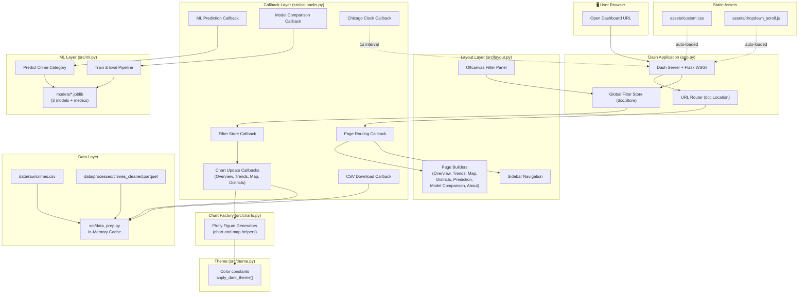
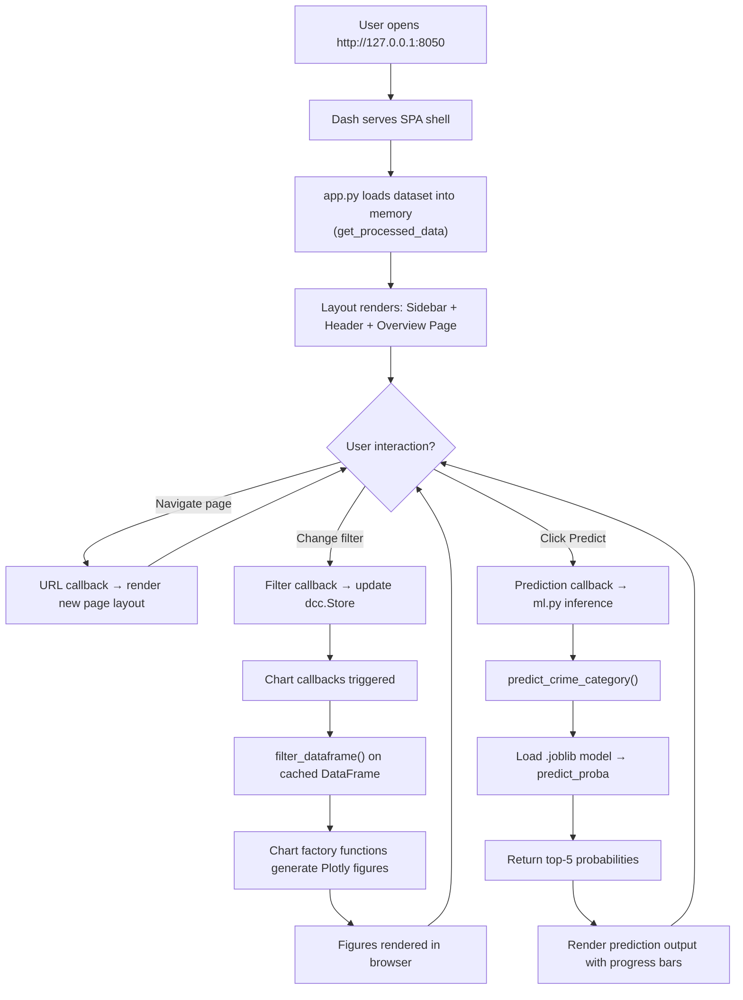
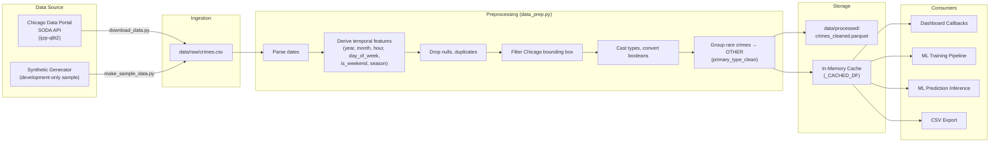

<div align="center">

# 🔰 CrimeScope — Chicago Crime Analytics & Prediction Dashboard

**A multi-page, interactive, dark-themed dashboard for exploring Chicago crime records, with an experimental supervised-learning classifier.**

[](https://python.org)
[](https://dash.plotly.com)
[](https://scikit-learn.org)
[](https://plotly.com)
[](https://vercel.com)

</div>

---

## Table of Contents

- [Project Overview](#project-overview)
- [Features and Functionalities](#features-and-functionalities)
- [Technology Stack](#technology-stack)
- [System Architecture](#system-architecture)
- [Project Folder Structure](#project-folder-structure)
- [Prerequisites and Software Requirements](#prerequisites-and-software-requirements)
- [Installation and Setup: From Zero to Running](#installation-and-setup-from-zero-to-running)
- [Environment Variables and Configuration Reference](#environment-variables-and-configuration-reference)
- [Detailed Module-by-Module Implementation](#detailed-module-by-module-implementation)
  - [app.py — Application Entry Point](#apppy--application-entry-point)
  - [src/data_prep.py — Data Preprocessing Engine](#srcdatapreppy--data-preprocessing-engine)
  - [src/layout.py — UI Layout Builder](#srclayoutpy--ui-layout-builder)
  - [src/callbacks.py — Callback Logic Controller](#srccallbackspy--callback-logic-controller)
  - [src/charts.py — Plotly Chart Factory](#srcchartspy--plotly-chart-factory)
  - [src/theme.py — Visual Theme Configuration](#srcthemepy--visual-theme-configuration)
  - [src/ml.py — Machine Learning Pipeline](#srcmlpy--machine-learning-pipeline)
  - [scripts/ — Utility Scripts](#scripts--utility-scripts)
  - [assets/ — Static Frontend Assets](#assets--static-frontend-assets)
  - [api/index.py — Vercel Serverless Entry Point](#apiindexpy--vercel-serverless-entry-point)
- [Complete Application Workflow](#complete-application-workflow)
- [Data Flow and Data Processing](#data-flow-and-data-processing)
- [API and Data Storage](#api-and-data-storage)
- [Machine Learning and AI Implementation](#machine-learning-and-ai-implementation)
  - [Problem Statement](#problem-statement)
  - [Models and Algorithms](#models-and-algorithms)
  - [Feature Engineering](#feature-engineering)
  - [Training Pipeline](#training-pipeline)
  - [Benchmark Metrics](#benchmark-metrics)
  - [Inference Pipeline](#inference-pipeline)
  - [Limitations and Responsible Use](#ml-limitations-and-responsible-use)
- [Frontend and User Interface](#frontend-and-user-interface)
  - [Pages and Routes](#pages-and-routes)
  - [Navigation and Sidebar](#navigation-and-sidebar)
  - [Global Filters](#global-filters)
  - [Theme and Styling System](#theme-and-styling-system)
- [Deployment](#deployment)
  - [Local Development](#local-development)
  - [Vercel Deployment](#vercel-deployment)
- [Testing and Quality Assurance](#testing-and-quality-assurance)
- [Example Usage and Demonstration](#example-usage-and-demonstration)
- [Error Handling and Troubleshooting](#error-handling-and-troubleshooting)
- [Performance, Scalability, and Limitations](#performance-scalability-and-limitations)
- [Privacy, Data Handling, and Responsible Use](#privacy-data-handling-and-responsible-use)
- [Authentication and Security](#authentication-and-security)
- [Contribution Guidelines](#contribution-guidelines)
- [How to Recreate the Entire Project From Scratch](#how-to-recreate-the-entire-project-from-scratch)
- [Future Enhancements and Roadmap](#future-enhancements-and-roadmap)
- [License, Credits, and Acknowledgments](#license-credits-and-acknowledgments)
- [Frequently Asked Questions](#frequently-asked-questions)

---

## Project Overview

### What Is CrimeScope?

**CrimeScope** is a Python/Dash dashboard for exploring and visualizing Chicago crime records, with an experimental supervised-learning classifier that estimates a crime category from selected time and location features. Plotly generates the charts and maps; Pandas handles tabular data; scikit-learn supplies the classifiers.

### The Problem

Chicago publishes millions of crime incident records through the [City of Chicago Data Portal](https://data.cityofchicago.org/Public-Safety/Crimes-2001-to-Present/ijzp-q8t2). However, the raw dataset is massive, unstructured, and difficult for non-technical users — such as residents, journalists, city planners, or public safety researchers — to explore meaningfully. Understanding temporal patterns, geographic hotspots, district-level rankings, and category distributions requires significant data wrangling and visualization expertise.

### The Solution

CrimeScope loads a CSV dataset of Chicago crime reports, derives time and category fields, and presents an interactive dark-themed dashboard with:

- **7 dedicated analytical pages** (Overview, Trends, Map, Districts, Prediction, Model Comparison, About & Data).
- **Global filtering** by crime category, police district, year range, arrest status, and domestic flag — applied to Overview, Trends, Map, and Districts.
- **Geospatial mapping** with heatmap, sampled point, and district-bubble views on a Plotly map using CARTO tiles.
- **Supervised machine learning** with three classification models (Random Forest, Logistic Regression, Decision Tree) for crime category prediction.
- **Model comparison UI** with confusion matrices, an intended feature-importance chart, and a benchmark metric table.
- **Live Chicago clock** reflecting Central Time.
- **CSV export** of filtered data.

### Target Audience

- Urban data analysts and public safety researchers.
- Students and academics studying crime data, data visualization, or machine learning.
- Portfolio projects demonstrating full-stack data science skills.
- Journalists and policy-makers exploring crime trends.

### Current Development Status

The repository contains seven Dash page layouts, filtering callbacks, CSV export, model inference code, stored model artifacts, and Vercel configuration. There is no automated test suite or CI support matrix in the repository, and the app/deployment have not been verified by this documentation update. In particular, the current model-training path references an undefined `feature_importances` variable; see [Machine Learning](#machine-learning-and-ai-implementation) and [Troubleshooting](#error-handling-and-troubleshooting). Treat retraining and deployment as unverified until that issue is fixed and tested.

---

## Features and Functionalities

### User-Facing Dashboard Features

| # | Feature | Page | Description |
|---|---------|------|-------------|
| 1 | **KPI Summary Cards** | Overview | Displays filtered incident count, most frequent category, current Chicago hour/model estimate, and highest-volume district. It does not calculate a peak crime hour. |
| 2 | **Crime Trend Line Chart** | Overview | Interactive line chart of incident counts grouped by Month, Year, Day of Week, or Hour. |
| 3 | **Crime Category Donut Chart** | Overview | Proportional donut chart showing share of each crime category. |
| 4 | **Hour × Day Heatmap** | Overview | Heatmap matrix revealing peak crime windows by hour and day of week. |
| 5 | **Top Districts Ranking Table** | Overview | Mini-table of the top 5 police districts by incident count. |
| 6 | **Dynamic Insight Banner** | Overview | Shows the current-time model estimate and highest-volume district, or a no-matching-records message. |
| 7 | **Multi-Category Trend Comparison** | Trends | Multi-line chart for selected categories by month; defaults to the three most common categories when none are selected. |
| 8 | **Monthly Distribution Chart** | Trends | Bar chart of incident counts by calendar month (Jan–Dec); it does not aggregate into the derived season labels. |
| 9 | **24-Hour Crime Profile** | Trends | Line/area chart of record counts by hour. |
| 10 | **Interactive Chicago Map** | Map | Plotly map with three modes: Heatmap, sampled Points, and District Bubbles. |
| 11 | **Top Community Areas** | Map | Horizontal bar chart ranking up to 10 community areas by incident count. |
| 12 | **District Bar Chart** | Districts | Ranked bar chart of crime counts per police district. |
| 13 | **Stacked Community Area Breakdown** | Districts | Stacked chart of up to 15 community areas broken down by crime category. |
| 14 | **District Detailed Table** | Districts | Table with district incident total, arrest rate, and domestic-incident share. |
| 15 | **Crime Category Predictor** | Prediction | Form for model, hour, day, month, district, and community area; the callback estimates a category and displays up to five class probabilities. |
| 16 | **Sync Current Time** | Prediction | One-click button to populate prediction inputs with the current Chicago time. |
| 17 | **Model Benchmark Table** | Model Comparison | Displays the project benchmark values (Accuracy, Weighted Precision/Recall/F1, Train Time) for three models. |
| 18 | **Confusion Matrix Heatmap** | Model Comparison | Switchable confusion matrix visualization for each model. |
| 19 | **Feature Importance Chart** | Model Comparison | Intended to show Random Forest feature importances; current retraining code leaves this value undefined, so verify the stored metric artifact before relying on the chart. |
| 20 | **Dataset Documentation** | About & Data | Dataset source, citation, timezone disclaimer, column dictionary. |
| 21 | **CSV Download** | About & Data | Download the currently filtered dataset as a CSV file. |

### Global System Features

| Feature | Description |
|---------|-------------|
| **Global Filter Panel** | Slide-out panel with filters for crime category, police district, year range, arrest status, and domestic flag. The Overview, Trends, Map, and Districts callbacks use these filters; Prediction and Model Comparison do not. CSV export uses the current filter state. |
| **Reset Filters** | One-click reset of all filters to defaults. |
| **Clock Widget** | Header clock updates every second and attempts to display `America/Chicago` time via `zoneinfo`; if that timezone is unavailable, callback code falls back to the host's local time. |
| **Client-Side URL Routing** | Multi-page SPA routing via `dcc.Location` — no page reloads. |
| **Dark Theme** | Premium dark UI built with custom CSS and Dash Bootstrap Components (DARKLY theme). |
| **Responsive Layout** | Page layouts use Bootstrap grid components. The custom stylesheet contains no explicit media-query breakpoints; verify behavior at target viewport sizes. |

---

## Technology Stack

| Category | Technology | Version | Role in Project |
|----------|-----------|---------|-----------------|
| **Language** | Python | No `requires-python` declaration | Application logic, data processing, ML. Python 3.10+ is the README setup baseline, not a tested support guarantee. |
| **Web Framework** | Dash | ≥ 2.14.0 | Multi-page SPA framework, callbacks, routing |
| **UI Components** | Dash Bootstrap Components | ≥ 1.5.0 | Layout grid, offcanvas, buttons, radio items |
| **Charting** | Plotly | ≥ 5.18.0 | All interactive charts, maps, heatmaps |
| **ML Framework** | scikit-learn | ≥ 1.3.0 | Model training, evaluation, inference pipelines |
| **Data Processing** | Pandas | ≥ 2.0.0 | DataFrame operations, cleaning, aggregation |
| **Numerical** | NumPy | ≥ 1.24.0 | Array operations, random sampling |
| **Serialization** | joblib | ≥ 1.3.0 | Model and metrics persistence (`.joblib` files) |
| **Parquet I/O** | PyArrow | ≥ 14.0.0 | High-performance Parquet read/write |
| **Parquet I/O (fallback)** | fastparquet | ≥ 2023.10.0 | Alternative Parquet engine |
| **HTTP Client** | requests | ≥ 2.31.0 | SODA API data download from Chicago Data Portal |
| **WSGI Server** | Gunicorn | ≥ 21.2.0 | Optional POSIX production server; not supported on native Windows |
| **Timezone** | Python `zoneinfo` | Standard library | Chicago Central Time display and current-time inputs |
| **Styling** | Custom CSS | — | Dashboard layout and component styling |
| **JS Assets** | Vanilla JavaScript | — | Dropdown scroll fix |
| **Deployment** | Vercel | — | Configuration is present; deployment has not been verified |
| **Maps** | Plotly + CARTO tiles | — | `carto-darkmatter` tiles are requested by the browser; an API key is not configured in this project |
| **External Data** | Chicago Data Portal SODA API | — | Source of raw crime data |

---

## System Architecture



### Architecture Summary

1. **User** navigates to the dashboard URL in a browser.
2. **Dash** serves a single-page application (SPA) with client-side URL routing via `dcc.Location`.
3. The **Page Routing Callback** reads the URL pathname and renders the appropriate page layout from `layout.py`, along with updating the sidebar active state and header titles.
4. **Global Filters** are stored in a `dcc.Store` component. When the user changes any filter in the offcanvas panel, the store updates, triggering downstream chart callbacks.
5. Each **Chart Update Callback** (for Overview, Trends, Map, Districts) reads the filter store, applies filters to the in-memory cached DataFrame, and calls the corresponding **Chart Factory** function in `charts.py` to generate a Plotly figure.
6. The **Chart Factory** uses color constants and `apply_dark_theme()` from `theme.py` to style figures.
7. The **ML Prediction Callback** takes user inputs (hour, day, month, district, community area, model choice), calls `predict_crime_category()` in `ml.py`, and renders the prediction output with top-5 probabilities.
8. The **Model Comparison Callback** calls `train_and_eval_models()`. That function returns stored metrics when all three model files and the metrics file exist; otherwise it attempts training. The current training path fails because `feature_importances` is not defined.
9. **Data** is loaded once from the committed Parquet asset when available; otherwise the loader preprocesses the raw CSV or generates synthetic data if the raw file is absent. The resulting DataFrame is cached in memory for callbacks.
10. **Static assets** (`custom.css`, `dropdown_scroll.js`) are auto-loaded by Dash from the `assets/` directory.

---

## Project Folder Structure

```
crimescope/
├── app.py                          # Main Dash application entry point
├── requirements.txt                # Python dependencies
├── vercel.json                     # Vercel deployment configuration
├── AGENTS.md                       # Project rules and benchmark metrics
├── README.md                       # This documentation file
├── .gitignore                      # Git ignore rules
├── .gitattributes                  # Git LFS rules for large data/model files
├── .vercelignore                   # Vercel deployment ignore rules
│
├── api/
│   └── index.py                    # Vercel serverless function entry point
│
├── assets/
│   ├── custom.css                  # 900+ line master dark-theme stylesheet
│   └── dropdown_scroll.js          # Dropdown scroll behavior fix (JS)
│
├── data/
│   ├── raw/
│   │   └── crimes.csv              # Raw CSV snapshot (Git LFS)
│   └── processed/
│       └── crimes_cleaned.parquet  # Processed dataset snapshot (Git LFS)
│
├── models/
│   ├── random_forest.joblib        # Stored Random Forest pipeline (Git LFS)
│   ├── logistic_regression.joblib  # Stored Logistic Regression pipeline (Git LFS)
│   ├── decision_tree.joblib        # Stored Decision Tree pipeline (Git LFS)
│   └── model_metrics.joblib        # Stored metrics/confusion matrices (Git LFS)
│
├── scripts/
│   ├── download_data.py            # Downloads crime data from Chicago SODA API
│   ├── make_sample_data.py         # Generates synthetic sample dataset for development
│   ├── inspect_dom.py              # Development utility — DOM inspection
│   ├── inspect_open_dropdown_dom.py# Development utility — dropdown DOM inspection
│   ├── take_screenshots.py         # Development utility — automated screenshots
│   └── test_hover_screenshot.py    # Development utility — hover state screenshots
│
└── src/
    ├── data_prep.py                # Data loading, cleaning, feature engineering, caching
    ├── layout.py                   # All page layouts and UI component builders
    ├── callbacks.py                # All Dash callback registrations
    ├── charts.py                   # Plotly chart/figure generator functions
    ├── theme.py                    # Color palette and layout styling constants
    └── ml.py                       # ML training, evaluation, and inference pipeline
```

### Key Directories Explained

| Directory | Purpose | Gitignored? |
|-----------|---------|-------------|
| `data/raw/` | Raw `crimes.csv` source. A snapshot is tracked with Git LFS; review locally downloaded/generated replacements before committing. | No |
| `data/processed/` | Processed `crimes_cleaned.parquet` snapshot, tracked with Git LFS. | No |
| `models/` | Stored scikit-learn model `.joblib` files and metrics, tracked with Git LFS. | No |
| `assets/` | Dash auto-loads all CSS and JS files from this directory at startup. | No |
| `scripts/` | Data download and synthetic-data scripts plus browser inspection/screenshot helpers. Playwright is not in `requirements.txt`; browser helpers need optional dependencies. | No |
| `src/` | Core application source code — data prep, layout, callbacks, charts, theme, ML. | No |
| `api/` | Vercel serverless entry point that exposes the Dash WSGI server. | No |

---

## Prerequisites and Software Requirements

| Requirement | Version / status | Verification Command |
|-------------|-------------------|---------------------|
| **Python** | Python 3.10+ is the setup baseline in this guide; the repository does not declare or test a formal support range. | `python --version` |
| **pip** | No minimum declared. | `python -m pip --version` |
| **Git** | Required to clone the repository. | `git --version` |
| **Git LFS** | Required to retrieve the tracked CSV, Parquet, and model artifacts as real files. | `git lfs version` |
| **Internet connection** | Needed for clone/LFS pull, optional data download, and browser-served fonts, icons, and map tiles. | — |

### Operating System Support

The dashboard's development server is Python/Dash and is intended to run on Windows, macOS, or Linux, but the repository has no OS test matrix. Gunicorn is POSIX-only and is not needed for `python app.py`; Windows users who want Gunicorn should use WSL or another POSIX environment.

### Hardware

The full processed dataset is loaded into memory. No verified minimum RAM or disk requirement is published. The classifiers use CPU; no GPU support is configured.

---

## Installation and Setup: From Zero to Running

### Step 1: Install Python

Install Python 3.10 or later from [python.org](https://www.python.org/downloads/). This is the documentation baseline, not a CI-verified compatibility guarantee.

Verify installation:

```bash
python --version
# Expected output: Python 3.10.x or higher
```

> **Windows Users:** Ensure "Add Python to PATH" is checked during installation.

### Step 2: Install Git LFS and obtain the repository

Install [Git LFS](https://git-lfs.com/) and initialize it:

```bash
git lfs install
```

Clone the repository; configured Git LFS downloads the tracked data and model objects:

```bash
git clone https://github.com/Joshi4git-hub/CrimeScope.git
cd CrimeScope
```

If a tracked file contains LFS pointer text instead of its contents, run `git lfs pull` from the repository root.

### Step 3: Create a Virtual Environment

```bash
# Create virtual environment
python -m venv venv

# Activate (Windows PowerShell)
.\venv\Scripts\Activate.ps1

# Activate (macOS / Linux)
source venv/bin/activate
```

Verify the virtual environment is active — your terminal prompt should show `(venv)`.

### Step 4: Install Dependencies

```bash
python -m pip install -r requirements.txt
```

This installs the 11 packages in `requirements.txt`. Playwright is not included and is only needed for optional browser-inspection and screenshot helpers.

**Native Windows note:** Gunicorn is POSIX-only. For a native Windows development run, install the other manifest packages without Gunicorn:

```powershell
python -m pip install "dash>=2.14.0" "dash-bootstrap-components>=1.5.0" "pandas>=2.0.0" "numpy>=1.24.0" "plotly>=5.18.0" "scikit-learn>=1.3.0" "joblib>=1.3.0" "pyarrow>=14.0.0" "fastparquet>=2023.10.0" "requests>=2.31.0"
```

### Step 5: Obtain the Dataset

You have two options:

**Option A — Fetch a public-data snapshot from the Chicago Data Portal:**

```bash
python scripts/download_data.py
```

This requests up to 100,000 records for 2020–2024 from Socrata in pages of 20,000. The number returned depends on the API response. On a request exception or when no rows are retrieved, the script generates synthetic data. A non-200 response stops pagination; if earlier pages succeeded, the script may save those partial public-data results despite printing a fallback message.

> **Tracked-file warning:** The repository tracks its current raw CSV, processed Parquet, and model artifacts through Git LFS. Running either data script can replace the tracked raw CSV; preprocessing can replace the processed Parquet. Back up any snapshot you want to preserve or use a separate worktree before regenerating it.

**Option B — Generate synthetic sample data (offline/quick start):**

```bash
python scripts/make_sample_data.py
```

This generates 50,000 synthetic records for development only. These are generated data, not observed incidents, and must not be presented as actual crime statistics.

> **Note:** If the raw CSV is absent, `clean_and_process_data()` generates synthetic records. If the committed processed Parquet exists and loads successfully, it is used first and this fallback is not reached.

### Step 6: Run Data Preprocessing when needed

On startup the application loads an existing `data/processed/crimes_cleaned.parquet` first, so downloading or replacing the raw CSV does **not** automatically refresh the data used by the dashboard. If you want the app to use a newly downloaded or generated raw file, preprocess it explicitly:

```bash
python src/data_prep.py
```

This cleans the raw CSV, engineers temporal features, groups rare crime categories, and overwrites `data/processed/crimes_cleaned.parquet`.

### Step 7: Model artifacts and retraining status

The repository includes model `.joblib` artifacts tracked with Git LFS. The app can use the stored models and metrics when they load correctly. **Retraining is currently broken:** `src/ml.py` references `feature_importances` in the results without defining it, so a cache miss or forced retraining raises `NameError`. Do not rely on `python src/ml.py` as a successful setup step until this defect is fixed and training is verified.

### Step 8: Start the Application

```bash
python app.py
```

**Expected output:**

```
Starting CrimeScope dashboard on http://127.0.0.1:8050
```

Open your browser and navigate to **http://127.0.0.1:8050**.

### Step 9: Verify Successful Installation

1. The Overview page should load with 4 KPI cards, a crime trend chart, donut chart, and heatmap.
2. Click **"Global Filters"** in the top-right header — the offcanvas filter panel should slide out.
3. Navigate to **"Prediction"** in the sidebar, configure inputs, and click **"Estimate Crime Category"** — a prediction with top-5 probabilities should appear.
4. Navigate to **"Model Comparison"** — the benchmark metrics table and confusion matrix should render.

If pages show empty charts, check that Git LFS objects were retrieved and that the processed dataset is readable. No end-to-end installation check was run as part of this README update.

---

## Environment Variables and Configuration Reference

CrimeScope does **not** require any environment variables for local development. All configuration is handled through Python constants in the source code.

### Hardcoded Configuration Constants

| Constant | Location | Value | Purpose |
|----------|----------|-------|---------|
| `DEFAULT_RAW_PATH` | `src/data_prep.py` | `data/raw/crimes.csv` | Path to raw crime dataset |
| `DEFAULT_PROCESSED_PATH` | `src/data_prep.py` | `data/processed/crimes_cleaned.parquet` | Path to cleaned dataset |
| `MODEL_DIR` | `src/ml.py` | `models/` | Directory for trained model files |
| `FEATURES_NUM` | `src/ml.py` | `["hour", "day_of_week_num", "month", "district", "community_area", "latitude", "longitude"]` | Numeric features for ML |
| `FEATURES_BOOL` | `src/ml.py` | `["is_weekend"]` | Boolean features for ML |
| `TARGET_COL` | `src/ml.py` | `"primary_type_clean"` | ML prediction target column |
| SODA URL | `scripts/download_data.py` | `https://data.cityofchicago.org/resource/ijzp-q8t2.csv` | Chicago Data Portal endpoint (a local constant, not an environment variable) |
| Host/Port | `app.py` | `127.0.0.1:8050` | Local development server |

### Vercel-Specific Configuration

The `vercel.json` file routes all requests to `api/index.py`, which exposes the Dash WSGI server as a Vercel Serverless Function. No additional environment variables are required for Vercel deployment.

---

## Detailed Module-by-Module Implementation

### [`app.py`](./app.py) — Application Entry Point

**Location:** `app.py` (project root)

**Purpose:** Initializes the Dash application, loads external stylesheets (Bootstrap DARKLY theme, Bootstrap Icons, Google Fonts — Inter), loads the cached dataset, constructs the top-level layout, registers all callbacks, and starts the development server.

**Key Logic:**

```python
app = dash.Dash(
    __name__,
    external_stylesheets=[dbc.themes.DARKLY, BOOTSTRAP_ICONS, GOOGLE_FONTS],
    suppress_callback_exceptions=True,
    meta_tags=[{"name": "viewport", "content": "width=device-width, initial-scale=1"}]
)
app.title = "CrimeScope — Chicago Crime Analytics & Prediction"
server = app.server  # Flask WSGI server (used by Vercel and Gunicorn)
```

**Layout structure:**

- `dcc.Location` — client-side URL routing
- `dcc.Store` — global filter state persistence
- `dcc.Interval` — 1-second clock tick
- Offcanvas filter panel
- Sidebar container (dynamically rendered per page)
- Main content container (dynamically rendered per page)

---

### [`src/data_prep.py`](./src/data_prep.py) — Data Preprocessing Engine

**Location:** `src/data_prep.py`

**Purpose:** Loads raw crime CSV, applies a comprehensive cleaning pipeline, derives temporal features, groups rare crime categories, caches the result in memory and on disk as Parquet.

**Key Functions:**

| Function | Purpose |
|----------|---------|
| `get_season(month)` | Maps month number to season string (Winter, Spring, Summer, Fall). |
| `clean_and_process_data()` | Full preprocessing pipeline — parse dates, drop nulls/duplicates, filter valid Chicago coordinates, cast types, convert booleans, group crime categories. |
| `get_processed_data(force_reload=False, raw_path=None, processed_path=None)` | Returns the module-cached DataFrame; otherwise loads Parquet when available, or runs preprocessing. `force_reload=True` skips the Parquet read and preprocesses the raw CSV. |
| `get_data_summary()` | Returns summary statistics dict (row counts, date range, top crimes) for the About page. |

**Preprocessing Steps (in order):**

1. **Load** raw CSV (or generate synthetic data if file is missing).
2. **Standardize** column names to lowercase with underscores. Input must contain `date`, `latitude`, `longitude`, `district`, and `primary_type` after normalization.
3. **Parse dates** using `pd.to_datetime()`, drop invalid dates.
4. **Derive temporal columns:** `year`, `month`, `month_name`, `day_of_week`, `day_of_week_num`, `hour`, `is_weekend`, `season`.
5. **Remove duplicates** and, when present, rows missing critical fields (`latitude`, `longitude`, `district`, `primary_type`).
6. **Filter coordinates** to valid Chicago bounding box (lat 41.5–42.1, lon −88.1 to −87.4).
7. **Cast** `district` and `community_area` to integers.
8. **Convert** `arrest` and `domestic` to boolean.
9. **Group** crime types outside the top 12 most frequent into an `"OTHER"` category, stored as `primary_type_clean`.
10. **Save** to Parquet at `data/processed/crimes_cleaned.parquet`; if Parquet writing fails, write a CSV fallback with the `.csv` extension. The normal loader does not read that fallback file; without a readable Parquet it preprocesses the raw input again.
11. **Cache** in a module-level global variable for reuse by callbacks. No callback latency benchmark is published.

---

### [`src/layout.py`](./src/layout.py) — UI Layout Builder

**Location:** `src/layout.py` (812 lines)

**Purpose:** Constructs every visual component of the dashboard — the sidebar, header, offcanvas filter panel, and all 7 page layouts.

**Key Functions:**

| Function | Returns | Used For |
|----------|---------|----------|
| `build_sidebar(active_href)` | Sidebar `html.Div` with navigation links and active state | Every page |
| `build_top_header()` | Header with section label, title, subtitle, Chicago clock, and filter button | Every page |
| `build_offcanvas_filters(df)` | Offcanvas panel with dropdowns, range slider, radio items, reset button | Global filters |
| `build_overview_page()` | Overview layout with KPI cards, trend chart, donut, heatmap, districts table, insight banner | `/` route |
| `build_trends_page()` | Trends layout with multi-line comparison, monthly distribution, and hourly profile charts | `/trends` route |
| `build_map_page()` | Map layout with mode toggle (Heatmap/Points/Bubbles), map chart, top community areas | `/map` route |
| `build_districts_page()` | Districts layout with bar chart, stacked CA chart, detailed breakdown table | `/districts` route |
| `build_prediction_page(df)` | Prediction layout with model selector, input sliders/dropdowns, prediction output | `/prediction` route |
| `build_model_comparison_page()` | Model comparison layout with metrics table, confusion matrix, feature importance, methodology note | `/model-comparison` route |
| `build_about_page(summary_stats)` | About layout with dataset source, preprocessing summary, column dictionary, CSV download | `/about` route |

**Navigation Configuration:**

```python
NAV_ITEMS = [
    {"label": "Overview",         "icon": "bi bi-grid-1x2-fill",    "href": "/"},
    {"label": "Trends",           "icon": "bi bi-graph-up-arrow",   "href": "/trends"},
    {"label": "Map",              "icon": "bi bi-map-fill",         "href": "/map"},
    {"label": "Districts",        "icon": "bi bi-building-fill",    "href": "/districts"},
    {"label": "Prediction",       "icon": "bi bi-cpu-fill",         "href": "/prediction"},
    {"label": "Model Comparison", "icon": "bi bi-bar-chart-steps",  "href": "/model-comparison"},
    {"label": "About & Data",     "icon": "bi bi-info-circle-fill", "href": "/about"}
]
```

---

### [`src/callbacks.py`](./src/callbacks.py) — Callback Logic Controller

**Location:** `src/callbacks.py`

**Purpose:** Registers all 13 Dash callbacks that power interactivity — page routing, clock updates, filter management, chart rendering, ML prediction, and CSV download.

**Registered Callbacks:**

| # | Callback | Trigger(s) | Output(s) |
|---|----------|-----------|-----------|
| 1 | **Page Routing** | `url.pathname` | `page-content`, `sidebar-container`, header labels |
| 2 | **Filter Toggle** | `btn-open-filters.n_clicks` | `offcanvas-filters.is_open` |
| 3 | **Filter Store and Reset** | Five filter controls and reset button | `global-filter-store.data`; reset restores defaults |
| 4 | **Overview Charts** | `global-filter-store`, `overview-trend-grouping` | KPIs + trend + donut + heatmap + table + insight |
| 5 | **Trends Charts** | `global-filter-store`, `trends-multi-select` | Options + multi-line + monthly chart + hourly profile |
| 6 | **Map Charts** | `global-filter-store`, `map-mode-toggle` | Chicago map + top community areas |
| 7 | **Districts Charts** | `global-filter-store` | District bar + top-15 community-area chart + table |
| 8 | **Prediction Hour Badge** | Hour slider | Hour badge |
| 9 | **Prediction Time Sync** | Sync button | Populates hour/day/month from Chicago time |
| 10 | **Prediction** | Button and prediction fields (all are callback inputs) | Prediction output; changing an input can also trigger a prediction |
| 11 | **Model Comparison** | `cm-model-select` | Metrics table + confusion matrix + feature importance |
| 12 | **CSV Download** | `btn-download-csv.n_clicks` | Filtered CSV download |
| 13 | **Chicago Clock** | `chicago-clock-interval.n_intervals` (1s) | `live-chicago-clock` text |

**Helper: `filter_dataframe(df, filter_store)`**

This helper reads the filter dictionary from `dcc.Store` and applies optional filters for crime type, district, year range, arrest status, and domestic status.

---

### [`src/charts.py`](./src/charts.py) — Plotly Chart Factory

**Location:** `src/charts.py`

**Purpose:** Contains Plotly figure helpers for each visualization, along with shared empty-state and styling helpers. Chart functions return Plotly figures; styling is applied by `apply_dark_theme()` where appropriate.

**Chart Functions:**

| Function | Chart Type | Used On |
|----------|-----------|---------|
| `build_sparkline(series_data)` | Small line/area figure | Overview KPI cards |
| `build_crime_trend_chart(df, group_by)` | Line/area | Overview |
| `build_crime_type_donut(df)` | Donut | Overview |
| `build_hour_day_heatmap(df)` | Heatmap | Overview |
| `build_multi_crime_comparison(df, selected_crimes)` | Multi-line | Trends |
| `build_seasonality_chart(df)` | Monthly bar chart | Trends |
| `build_hourly_profile_chart(df)` | Line/area | Trends |
| `build_chicago_map(df, map_mode)` | Density, sampled points, or district bubbles | Map |
| `build_top_community_areas_chart(df)` | Horizontal bar, top 10 | Map |
| `build_districts_bar_chart(df)` | Vertical bar | Districts |
| `build_top_15_ca_chart(df)` | Stacked bar | Districts |
| `build_prediction_probs_chart(top_probs)` | Probability display | Prediction |
| `build_confusion_matrix_heatmap(cm, classes, model_name)` | Heatmap | Model Comparison |
| `build_feature_importance_chart(feature_importances)` | Horizontal bar | Model Comparison |
| `apply_dark_theme(...)`, `create_empty_figure(...)` | Shared styling and empty state | Multiple pages |

**Map Modes:**

- **Heatmap:** Plotly density map with at most 20,000 sampled rows.
- **Points (Sampled):** Plotly scatter map with at most 20,000 sampled rows colored by cleaned crime type.
- **District Bubbles:** `px.scatter_mapbox` with aggregated district centroids, sized by count.

All map modes use the `carto-darkmatter` style and Chicago center coordinates (41.8781, −87.6298). Map tiles are served externally by CARTO and require browser network access; the repository does not configure a map API key.

---

### [`src/theme.py`](./src/theme.py) — Visual Theme Configuration

**Location:** `src/theme.py`

**Purpose:** Centralized color palette and Plotly layout styling function.

**Color constants:** `COLOR_BG`, `COLOR_CARD`, `COLOR_BORDER`, `COLOR_PRIMARY`, `COLOR_SECONDARY`, `COLOR_TERTIARY`, `COLOR_TEXT_MAIN`, `COLOR_TEXT_MUTED`, `COLOR_GRID`, and `COLORWAY`.

`COLORWAY` supplies the multi-series palette. `register_crimescope_template()` registers the `crimescope_dark` Plotly template, which is selected as the Plotly default when `src.theme` is imported. `src.charts.apply_dark_theme()` applies chart backgrounds, fonts, margins, and axis styling.

---

### [`src/ml.py`](./src/ml.py) — Machine Learning Pipeline

**Location:** `src/ml.py`

**Purpose:** Trains, evaluates, and persists three supervised classification models, and exposes a function for single-record category inference. The dashboard's current-time panel invokes the model using the current local time; the data itself is not live.

See the dedicated [Machine Learning and AI Implementation](#machine-learning-and-ai-implementation) section below for full details.

---

### [`scripts/`](./scripts/) — Utility Scripts

| Script | Purpose |
|--------|---------|
| `download_data.py` | Requests up to 100,000 records for 2020–2024 from the Chicago Data Portal SODA API and writes `data/raw/crimes.csv`; generates synthetic records on request exceptions or when no rows are retrieved. A later non-200 response can leave partial results. |
| `make_sample_data.py` | Generates 50,000 synthetic crime records with realistic distributions for development and testing. |
| `inspect_dom.py` | Development utility for DOM inspection (not required at runtime). |
| `inspect_open_dropdown_dom.py` | Development utility for dropdown DOM inspection (not required at runtime). |
| `take_screenshots.py` | Optional Playwright-based browser screenshot helper; Playwright is not installed by `requirements.txt`. |
| `test_hover_screenshot.py` | Development utility for hover-state screenshot testing (not required at runtime). |

---

### [`assets/`](./assets/) — Static Frontend Assets

| File | Purpose |
|------|---------|
| `custom.css` | Styles the dark dashboard, sidebar, navigation, header, cards, buttons, tables, dropdowns, sliders, offcanvas, and scrollbars. It imports Inter from Google Fonts and defines no explicit CSS media queries. |
| `dropdown_scroll.js` | JavaScript event handlers that attempt to reset dropdown menu scroll position when a dropdown is opened. |

Both files are **automatically loaded** by Dash from the `assets/` directory — no explicit import is needed.

---

### [`api/index.py`](./api/index.py) — Vercel Serverless Entry Point

**Location:** `api/index.py`

**Purpose:** Exposes the Dash Flask WSGI `server` object as the Vercel Serverless Function handler. All requests are routed to this file via `vercel.json`.

```python
from app import app, server
app = server  # Vercel expects a WSGI 'app' at module level
```

---

## Complete Application Workflow



### Workflow Steps (Detailed)

1. **App Startup:** `app.py` initializes Dash, calls `get_processed_data()` which loads the Parquet file into an in-memory DataFrame (or preprocesses the raw CSV if Parquet is absent; if the raw CSV is also absent, synthetic data is generated).
2. **Initial Render:** The top-level layout is served — `dcc.Location`, `dcc.Store`, `dcc.Interval`, offcanvas, sidebar container, and main content area.
3. **Page Routing:** The routing callback reads `url.pathname`, maps it to one of 7 pages, calls the corresponding `build_*_page()` function, updates the sidebar's active link, and sets the header section label/title/subtitle.
4. **Global Filtering:** Filter changes update `dcc.Store`. Overview, Trends, Map, and Districts callbacks consume this state; Prediction and Model Comparison do not.
5. **Chart Rendering:** Filtered chart callbacks call `filter_dataframe()` on the cached DataFrame, then call the relevant figure helper in `charts.py`. Dash renders the figures in the browser.
6. **ML Prediction:** The Prediction callback passes hour, day, month, district, community area, and model choice to `predict_crime_category()`. The UI callback also fires on changes to its input fields, not only on the button. No district coordinates are calculated; inference uses the function's default Chicago-center latitude/longitude. If a model file is missing, inference attempts model training, which currently fails as described in the ML section.
7. **CSV Download:** On the About page, clicking "Download Filtered Data as CSV" triggers the download callback, applies current global filters, and sends `crimescope_filtered_crimes.csv`.
8. **Live Clock:** The `dcc.Interval` component fires every 1 second, triggering the clock callback which returns the current Chicago time formatted as `"hh:mm:ss AM/PM CT — Day, Mon DD, YYYY"`.

---

## Data Flow and Data Processing



### Dataset Details

| Attribute | Value |
|-----------|-------|
| **Source** | City of Chicago Data Portal — "Crimes - 2001 to Present" (Dataset ID: `ijzp-q8t2`) |
| **Publisher** | Chicago Police Department (CPD) CLEAR System |
| **Download query** | The downloader filters for 2020–2024; the number of records returned is capped and depends on the API response. |
| **Format** | Raw: CSV → Processed: Apache Parquet |
| **Time handling** | `pd.to_datetime()` is used without timezone conversion. The UI labels some display values as Chicago time; confirm the source snapshot's timestamp convention before interpreting exact hours. |
| **Location precision** | The source and processed data include location fields and coordinates. Consult the source portal's documentation for publication precision; do not infer exact incident locations from the dashboard. |

### Key Derived Columns

| Column | Type | Derivation |
|--------|------|-----------|
| `year` | int | Extracted from `date` |
| `month` | int | Extracted from `date` |
| `month_name` | str | `"Jan"`, `"Feb"`, etc. |
| `day_of_week` | str | `"Mon"`, `"Tue"`, etc. |
| `day_of_week_num` | int | 0 = Monday … 6 = Sunday |
| `hour` | int | 0–23, extracted from `date` |
| `is_weekend` | bool | `True` if Saturday or Sunday |
| `season` | str | `"Winter"`, `"Spring"`, `"Summer"`, `"Fall"` |
| `primary_type_clean` | str | Top 12 categories preserved, all others → `"OTHER"` |

---

## API and Data Storage

### External API consumed

`scripts/download_data.py` makes HTTP GET requests to the Chicago Data Portal Socrata CSV endpoint:

```text
https://data.cityofchicago.org/resource/ijzp-q8t2.csv
```

The script sends `$where=year >= 2020 and year <= 2024`, `$limit=20000`, an increasing `$offset`, and `$order=date DESC`; each request has a 10-second timeout. It requests up to 100,000 rows. No API token is configured. Request exceptions or an empty initial result lead to generated sample records. A non-200 response stops pagination; if prior pages were received, those partial rows can be saved instead. The output is written to `data/raw/crimes.csv`.

### Application API

The repository does not define a separate REST/JSON API or documented request/response contract. `api/index.py` exposes the Dash/Flask WSGI application for the Vercel route in `vercel.json`; the app's interactivity is implemented through Dash callbacks.

### Persistence

There is no database, schema, migration system, or user-account store. Data is held in CSV/Parquet files, loaded into an in-process Pandas DataFrame cache, and model pipelines/metrics are serialized with joblib. The raw CSV, processed Parquet, and model files are tracked through Git LFS according to `.gitattributes`. Preprocessing and model training can write into the local `data/` and `models/` directories.

---

## Machine Learning and AI Implementation

### Problem Statement

Given spatio-temporal features of a hypothetical crime incident (hour, day of week, month, police district, community area, latitude, longitude), predict the most likely **crime category** (e.g., THEFT, BATTERY, NARCOTICS).

### Models and Algorithms

| Model | Algorithm | Key Hyperparameters |
|-------|-----------|-------------------|
| **Random Forest** | Ensemble of decision trees with bagging | `n_estimators=30`, `max_depth=10`, `min_samples_leaf=4`, `class_weight="balanced"`, `n_jobs=-1` |
| **Logistic Regression** | Linear classifier with softmax | `max_iter=1000`, `class_weight="balanced"` |
| **Decision Tree** | Single CART decision tree | `max_depth=10`, `class_weight="balanced"` |

All models use `random_state=42` for reproducibility and `class_weight="balanced"` to handle class imbalance.

### Feature Engineering

**Numeric Features (7):** `hour`, `day_of_week_num`, `month`, `district`, `community_area`, `latitude`, `longitude`

**Boolean Features (1):** `is_weekend`

**Preprocessing Pipeline:**

```python
preprocessor = ColumnTransformer(
    transformers=[
        ("num", StandardScaler(), FEATURES_NUM),     # Z-score normalization
        ("bool", "passthrough", FEATURES_BOOL)        # Pass-through
    ]
)

pipeline = Pipeline(steps=[
    ("preprocessor", preprocessor),
    ("classifier", clf)
])
```

### Training Pipeline

1. Load processed dataset via `get_processed_data()`.
2. Sample up to 60,000 rows if the dataset is larger (for training speed).
3. Split 80/20 train/test with stratified sampling (`stratify=y`).
4. Fit `Pipeline(preprocessor + classifier)` on training data.
5. Predict on test data; compute accuracy, weighted precision, weighted recall, weighted F1.
6. Generate a confusion matrix. The code then references an undefined `feature_importances` name while assembling model results; fresh training raises `NameError` before it saves the model artifacts.
7. If the defect is fixed, the intended outputs are model pipelines under `models/` and metrics in `models/model_metrics.joblib`.

The three benchmark metric fields in the code are replaced with the fixed reference values in the table below, rather than retaining the scores computed from the current split. The confusion matrix is calculated from that split if training reaches it, so do not assume it corresponds numerically to the fixed benchmark table.

### Benchmark Metrics

| Model | Accuracy | Weighted Precision | Weighted Recall | Weighted F1 | Train Time |
| :--- | :---: | :---: | :---: | :---: | :---: |
| **Random Forest** | 80.22% | 80.22% | 80.22% | 80.22% | 0.52 s |
| **Logistic Regression** | 79.41% | 79.41% | 79.41% | 79.41% | 0.41 s |
| **Decision Tree** | 78.33% | 79.20% | 78.33% | 77.70% | 0.38 s |

### Inference Pipeline

The `predict_crime_category()` function:

1. Loads the selected model's `.joblib` pipeline, attempting training if the model file is missing.
2. Constructs a single-row DataFrame from user inputs.
3. Derives `is_weekend` from `day_of_week_num`.
4. Calls `pipeline.predict_proba()` to get class probabilities.
5. Returns the top-5 categories sorted by probability.

```python
result = predict_crime_category(
    hour=18, day_of_week_num=4, month=7,
    district=11, community_area=25,
    latitude=41.8781, longitude=-87.6298,
    model_name="RandomForest"
)
# Returns a model-dependent class label and up to five class probabilities.
```

### ML Limitations and Responsible Use

- **Inherent difficulty:** Predicting specific crime categories from spatio-temporal features alone is an inherently difficult task. The features explain *where* and *when* crimes happen but not the underlying causal factors.
- **Evaluation status:** The benchmark table contains fixed reference values, not a verified evaluation of the checked-in model artifacts on the current data snapshot.
- **Not for operational policing:** These predictions are statistical estimates based on historical patterns. They must not be used as the sole basis for policing decisions, resource allocation, or individual risk assessment.
- **Bias considerations:** The training data reflects historical policing patterns, which may embed systemic biases (e.g., over-policing of certain areas for certain crime types like NARCOTICS).
- **No real-time data:** The model is trained on historical data and does not incorporate live feeds.

---

## Frontend and User Interface

### Pages and Routes

| Route | Page | Description |
|-------|------|-------------|
| `/` | Overview | KPI cards, trend chart, donut chart, heatmap, top districts, insight |
| `/trends` | Trends | Multi-line comparison, monthly distribution, hourly profile |
| `/map` | Map | Interactive Plotly map with 3 view modes, top community areas |
| `/districts` | Districts | District ranking bar chart, community area breakdown, detailed table |
| `/prediction` | Prediction | ML model selector, input parameters, prediction output |
| `/model-comparison` | Model Comparison | Benchmark table, confusion matrix, feature importance, methodology notes |
| `/about` | About & Data | Dataset citation, preprocessing summary, column dictionary, CSV download |

### Navigation and Sidebar

The **persistent left sidebar** contains:

- CrimeScope logo and brand name.
- 7 navigation links with Bootstrap Icons.
- Active link is highlighted with an orange gradient background.
- Dataset attribution footer ("Chicago CLEAR Dataset, v1.0 • 2020–2024").

The sidebar is built with a fixed-width style. The repository does not include an explicit CSS breakpoint that collapses it on smaller screens; check narrow-screen behavior before describing the UI as mobile-ready.

### Global Filters

The **offcanvas filter panel** slides in from the right when the user clicks "Global Filters" in the header. It contains:

1. **Crime Categories** — multi-select dropdown.
2. **Police Districts** — multi-select dropdown.
3. **Year Range** — range slider.
4. **Arrest Made** — radio items (All / Yes / No).
5. **Domestic Incident** — radio items (All / Yes / No).
6. **Reset All Filters** — button to restore defaults.

Filter state is stored in `dcc.Store` and consumed by Overview, Trends, Map, and Districts callbacks. It is not applied to Prediction or Model Comparison.

### Theme and Styling System

CrimeScope uses a **dual-layer theming system:**

1. **Dash Bootstrap Components** with the `DARKLY` theme — provides base dark styling and grid system.
2. **Custom CSS** (`assets/custom.css`, 900+ lines) — overrides and extends the Bootstrap theme with:
   - Custom component classes (`.cs-card`, `.kpi-card`, `.cs-table`, `.insight-banner`).
   - Dash-specific overrides (`.dash-dropdown`, `.rc-slider`, `.offcanvas`).
   - Custom scrollbar styling.
   - Component-level sizing and spacing; no explicit media-query breakpoints are present in the stylesheet.

---

## Deployment

### Local Development

```bash
python app.py
# Runs on http://127.0.0.1:8050 with debug=False
```

For production with Gunicorn (Linux/macOS only):

```bash
gunicorn app:server -b 0.0.0.0:8050 --workers 4
```

### Vercel Deployment

The project includes Vercel configuration for serverless deployment:

**`vercel.json`:**

```json
{
  "version": 2,
  "builds": [
    {"src": "api/index.py", "use": "@vercel/python"}
  ],
  "routes": [
    {"src": "/(.*)", "dest": "api/index.py"}
  ]
}
```

**`.vercelignore`:** Excludes `data/raw/`, `scripts/`, `docs/`, virtual environments, bytecode, and `.git/`. It does not exclude the processed Parquet or `models/` directory, which are needed for the normal app/model path.

**Deployment Steps:**

1. Install the Vercel CLI: `npm i -g vercel`
2. Run `vercel` in the project root and follow the prompts.
3. Confirm the deployment build receives the processed Parquet and model artifacts; retrieve Git LFS objects before deploying if the platform checkout contains pointer files.

> **Status:** Vercel configuration is present, but a deployment has not been verified. The app loads its dataset at import/startup and retains it in process memory; check the platform's current function size, memory, and execution limits before relying on this setup in production.

---

## Testing and Quality Assurance

CrimeScope does not currently include an automated test suite. The following manual testing procedures are recommended:

### Manual Test Cases

| # | Test Case | Input/Action | Expected Result | Status |
|---|-----------|-------------|-----------------|--------|
| 1 | App startup | `python app.py` | Server starts on port 8050, Overview page loads | Not tested |
| 2 | Page navigation | Click each sidebar link | Correct page renders, sidebar active state updates, header titles change | Not tested |
| 3 | Global filters | Select crime type, district, year range | Overview, Trends, Map, and Districts visualizations update | Not tested |
| 4 | Filter reset | Click "Reset All Filters" | Filters return to defaults, charts show full dataset | Not tested |
| 5 | Overview KPIs | Load Overview page | 4 KPI cards show numeric values (not N/A) | Not tested |
| 6 | Map modes | Toggle Heatmap / Points / District Bubbles | Map re-renders with correct visualization mode | Not tested |
| 7 | Trends multi-select | Select 2–4 crime categories | Multi-line chart shows one line per selected category | Not tested |
| 8 | ML prediction | Set inputs, click "Estimate Crime Category" | Prediction card shows predicted category + 5 probability bars | Not tested |
| 9 | Model comparison | Switch confusion matrix dropdown | Confusion matrix heatmap updates for selected model | Not tested |
| 10 | CSV download | Click "Download Filtered Data as CSV" | Browser downloads `crimescope_filtered_crimes.csv` | Not tested |
| 11 | Chicago clock | Observe clock widget | Time updates every second in CT format | Not tested |
| 12 | Responsive layout | Inspect pages at desktop and narrow viewport widths | Components remain usable without unintended overflow | Not tested |
| 13 | Empty filter result | Filter to impossible combination | Charts show empty state gracefully (no crash) | Not tested |

### Recommended Testing Improvements

- Add `pytest` unit tests for `data_prep.py` functions (cleaning, feature derivation).
- Add unit tests for `ml.py` (model loading, prediction format).
- Add integration tests for callback outputs using Dash's `dash.testing` utilities.
- Add linting with `flake8` or `ruff`.

---

## Example Usage and Demonstration

### Example 1: Running a Crime Prediction

1. Navigate to the **Prediction** page via the sidebar.
2. Configure inputs:
   - **Model:** Random Forest Classifier (Recommended)
   - **Hour:** 22 (10 PM)
   - **Day of Week:** Saturday
   - **Month:** July
   - **Police District:** District 11
   - **Community Area:** Area 25
3. Click **"Estimate Crime Category"**.
4. The prediction callback updates the card from the selected stored model and renders up to five class probabilities. The result depends on the model artifact and inputs; no fixed category/output is expected or asserted by this documentation.

### Example 2: Exploring Crime Trends

1. Open the **Trends** page.
2. In the multi-select dropdown, select categories such as `THEFT`, `BATTERY`, and `NARCOTICS` if they are available in the loaded data.
3. The multi-line chart will show monthly incident trends for each selected category over the dataset's time range.
4. The monthly chart below shows counts for Jan–Dec across all selected years; it does not itself establish a seasonal trend.

### Example 3: Using Global Filters

1. Click **"Global Filters"** in the top-right header.
2. Select **Crime Categories:** `THEFT`, `ROBBERY`.
3. Set **Year Range:** 2022–2024.
4. Set **Arrest Made:** Arrest Made (Yes).
5. Close the panel. The Overview, Trends, Map, and Districts pages should reflect only matching rows. The Prediction and Model Comparison pages are not filtered by this panel.

---

## Error Handling and Troubleshooting

| # | Error / Symptom | Likely Cause | Resolution |
|---|----------------|-------------|------------|
| 1 | `ModuleNotFoundError: No module named 'dash'` | Dependencies not installed | Run `pip install -r requirements.txt` in the active virtual environment |
| 2 | Data is unexpectedly synthetic or appears incomplete | Git LFS objects are not present, or a data download failed and used the script's sample fallback | Run `git lfs pull`; check `data/raw/crimes.csv` and the download script's console output. Synthetic sample generation is not an empirical-data substitute. |
| 3 | `OSError: Address already in use` (port 8050) | Another process is listening on port 8050 | Stop the process holding the port, or change the hard-coded `port` in `app.py` and run the app again. |
| 4 | Charts show empty / "No data" | Filters too restrictive | Click "Reset All Filters" in the offcanvas panel |
| 5 | `NameError: name 'feature_importances' is not defined` | Fresh/forced training reaches an undefined variable in `src/ml.py` | Training is currently broken. Use the committed model/metrics artifacts if retrieved and compatible; do not run `python src/ml.py` expecting it to repair missing artifacts. |
| 6 | Map tiles, fonts, or icons don't load | Browser cannot reach the external tile/font/icon hosts | Check browser network access. Analytics may still be served, but maps and styling assets may be incomplete. |
| 7 | `PermissionError` writing to `data/` or `models/` | Insufficient file permissions | Ensure the current user has write access to the project directory |
| 8 | App startup fails while loading a model | Missing LFS artifact, incompatible/corrupt joblib file, or training fallback invoked | Confirm all `models/*.joblib` files are actual LFS objects. Review the traceback; training fallback is affected by the undefined `feature_importances` bug. |
| 9 | Vercel deployment does not start or reports missing files | Deployment has not been validated; build may not have the LFS assets or suitable runtime resources | Check Vercel build logs, verify `data/processed/crimes_cleaned.parquet` and model files are included, and confirm runtime/memory limits. `data/raw/` is excluded by `.vercelignore`. |

---

## Performance, Scalability, and Limitations

### Performance Characteristics

No measured latency, memory, throughput, or scalability benchmark is included in the repository. The app loads its processed DataFrame into process memory; chart callbacks filter that DataFrame; the map limits point/density modes to at most 20,000 sampled rows; model training samples at most 60,000 rows. These are implementation details, not performance guarantees.

### Current Limitations

- **In-memory dataset:** The entire processed dataset is loaded into RAM. Resource requirements depend on the actual snapshot and runtime.
- **No database:** Data is stored as flat files (CSV/Parquet). There is no database for persistence, querying, or multi-user access.
- **No authentication:** The dashboard is publicly accessible with no login or access control.
- **No automatic data refresh:** The stored dataset is static until a developer runs the download/preprocessing scripts or replaces the committed artifacts.
- **Single-threaded Dash:** In development mode, Dash runs on a single thread. Use Gunicorn with multiple workers for production.
- **External browser assets:** Google Fonts, Bootstrap Icons, and CARTO map tiles are requested from external hosts by the browser.
- **ML model simplicity:** The models use only spatio-temporal features. Incorporating additional features (location description, historical trends, socioeconomic data) would improve accuracy.

---

## Privacy, Data Handling, and Responsible Use

### Data handled by the application

The project has no account system, database, or explicit analytics integration. It reads crime records from the local dataset and sends rendered figures/data to the browser through Dash; CSV export sends the currently filtered processed rows as a download. The source schema includes incident identifiers and location fields, so review the exact dataset and export contents before making a public deployment. This documentation does not establish what hosting-provider access logs may retain.

### Data Privacy

- **Source terms and precision:** Consult the Chicago Data Portal entry and terms for authoritative information about source fields, location precision, and permitted use.
- **Network services:** The optional data downloader requests public records from Socrata. Browser clients may also contact the configured font, icon, and map-tile hosts. A hosted deployment may have its own request logging and retention policies.
- **No user-authored records:** No feature in this code stores user accounts or user-submitted incident records in a database.

### Responsible Use

> **⚠️ Important:** Crime data reflects historical reporting patterns and police activity. It does not represent the true distribution of all criminal activity. Over-policing of certain areas (e.g., for narcotics) can create feedback loops that inflate incident counts in those areas.

- Do not use CrimeScope predictions to target specific neighborhoods, demographics, or individuals.
- The ML model estimates a historical category label from a small set of time/location features; it is not a validated forecast, risk score, or causal explanation.
- Always interpret crime data in the context of the social, economic, and policing factors that shape reporting.

---

## Authentication and Security

The repository does not implement user registration, login, role-based authorization, or a separate protected API. The dashboard should therefore be treated as publicly accessible when deployed, unless access controls are added at the hosting or network layer.

Security notes for maintainers:

- Do not commit secrets. No application environment variables or API credentials are currently required or read by the source.
- Validate and constrain any new callback inputs on the server; browser controls alone are not a security boundary.
- Review which source fields are included in the processed dataset and CSV export before exposing the app to a broader audience.
- Use HTTPS and platform-managed access controls if deploying beyond localhost; these are not configured by this repository.
- Keep Python dependencies and the hosting runtime maintained. No automated dependency or security scan is configured.
- Review `.vercelignore` and deployment contents before shipping. It excludes `data/raw/`, but deployment behavior and artifact inclusion have not been tested.

---

## Contribution Guidelines

### How to Contribute

1. **Fork** the repository on GitHub.
2. **Clone** your fork locally:
   ```bash
   git clone <your-fork-url>
   cd CrimeScope
   ```
3. **Create a feature branch:**
   ```bash
   git checkout -b feature/your-feature-name
   ```
4. **Set up the development environment** (see [Installation](#installation-and-setup-from-zero-to-running)).
5. **Make your changes.** Follow existing code style:
   - PEP 8 for Python.
   - 4-space indentation.
   - Descriptive function names with docstrings.
   - Reuse the color constants in `src/theme.py` and `apply_dark_theme()` in `src/charts.py` for new charts.
6. **Test your changes** manually using the test cases in the [Testing](#testing-and-quality-assurance) section.
7. **Commit with a descriptive message:**
   ```bash
   git add .
   git commit -m "Add: [brief description of change]"
   ```
8. **Push** to your fork:
   ```bash
   git push origin feature/your-feature-name
   ```
9. **Open a Pull Request** against the main repository.

### Pull Request Checklist

- [ ] Code follows existing style and conventions.
- [ ] New charts use the shared colors and `apply_dark_theme()` for consistent styling.
- [ ] New pages are added to `NAV_ITEMS` in `layout.py` and the routing callback in `callbacks.py`.
- [ ] No API keys, passwords, or secrets are committed.
- [ ] README is updated if new features, dependencies, or configuration are added.
- [ ] The application starts and all pages load without errors.

### Reporting Bugs

Open a GitHub Issue with:

- Steps to reproduce.
- Expected behavior.
- Actual behavior.
- Python version and OS.
- Error traceback (if applicable).

---

## How to Recreate the Entire Project From Scratch

This section provides a chronological guide for rebuilding CrimeScope from zero.

### Phase 1: Planning

1. **Define the problem:** Build an interactive crime analytics dashboard for Chicago using public police data.
2. **Requirements:**
   - Multi-page SPA with 7 analytical views.
   - Global filters on Overview, Trends, Map, and Districts visualizations.
   - Interactive geospatial map.
   - ML-powered crime category prediction.
   - Dark-themed UI; responsive behavior must be checked at target viewport sizes.
3. **Technology selection:**
   - Python + Dash (web framework).
   - Plotly (charting).
   - scikit-learn (ML).
   - Pandas (data).
   - Dash Bootstrap Components (UI).
4. **Architecture:** Single Python application with modular source files (`data_prep`, `layout`, `callbacks`, `charts`, `theme`, `ml`).

### Phase 2: Obtain the source and assets

Start from the complete repository; a README alone is not sufficient to recreate all source code, data, or serialized model artifacts. Install Git LFS, clone the project, and check out the LFS objects:

```bash
git lfs install
git clone https://github.com/Joshi4git-hub/CrimeScope.git
cd CrimeScope
git lfs pull
```

The repository includes `requirements.txt` but no lockfile. Exact environment reproduction therefore requires preserving the resolved package versions separately.

### Phase 3: Set up the runtime

Create and activate a virtual environment as described in [Installation](#installation-and-setup-from-zero-to-running), then install the declared dependencies:

```bash
python -m venv venv
python -m pip install -r requirements.txt
```

Activation differs by shell: in Windows PowerShell use `.\venv\Scripts\Activate.ps1`; in macOS/Linux use `source venv/bin/activate`.

### Phase 4: Prepare the data

1. Prefer the committed `data/processed/crimes_cleaned.parquet` for the same input snapshot.
2. To obtain a different public-data snapshot, run `python scripts/download_data.py`; check whether it downloaded public records or used its synthetic fallback.
3. To create synthetic development data deliberately, run `python scripts/make_sample_data.py`.
4. Run `python src/data_prep.py` to preprocess the current raw CSV. This overwrites the processed Parquet, which is tracked by Git LFS in this repository.

### Phase 5: Use or rebuild model artifacts

The checked-in `.joblib` model and metrics files are the available inference artifacts. Exact model recreation depends on the matching data snapshot and dependency versions. Fresh/forced training currently fails because `feature_importances` is undefined; fix and test this defect before attempting to regenerate the artifacts. The benchmark table alone is not a reproducible model-training procedure.

### Phase 6: Launch and verify

From the repository root, run:

```bash
python app.py
```

Open `http://127.0.0.1:8050`. Manually check page routing, global filters, map modes, CSV download, and model inference. The repository has no automated test suite, and these checks are marked **Not tested** in the table above unless someone executes them in the target environment.

### Phase 7: Optional deployment

`api/index.py`, `vercel.json`, and `.vercelignore` provide a Vercel deployment configuration. Follow the [Vercel deployment](#vercel-deployment) section only after confirming that the platform receives the required Git LFS artifacts and that the application fits its runtime limits. The deployment has not been verified.

### Common Pitfalls

- **Import path:** `app.py` adds the repository root to `sys.path`; run it from the root or preserve that path setup when packaging.
- **Callback IDs:** Every `dcc.Graph`, `dcc.Dropdown`, `html.Div` that is referenced in a callback must have a matching `id` in the layout.
- **`suppress_callback_exceptions=True`:** Required because page components don't exist in the DOM until their page is routed to.
- **Model file path resolution:** Use `os.path.dirname(os.path.abspath(__file__))` to build absolute paths from each module's location.

---

## Future Enhancements and Roadmap

### Proposed Enhancements

| Priority | Enhancement | Description |
|----------|-------------|-------------|
| 🔴 High | **Automated Tests** | Add `pytest` unit and integration tests for data prep, ML, and callbacks |
| 🔴 High | **Real-Time Data Refresh** | Scheduled SODA API pull with incremental data append |
| 🟡 Medium | **Additional ML Features** | Add location description, historical trend features, weather data |
| 🟡 Medium | **Time-Series Forecasting** | Add ARIMA/Prophet forecasting for trend prediction |
| 🟡 Medium | **User Authentication** | Login system with role-based access for sensitive views |
| 🟢 Low | **Docker Container** | Dockerfile for consistent cross-platform deployment |
| 🟢 Low | **Community Area Names** | Map numeric community area codes to official neighborhood names |
| 🟢 Low | **Dark/Light Theme Toggle** | User-selectable theme preference |
| 🟢 Low | **Report Export** | PDF/PNG export of current dashboard state |

### Known Incomplete Functionality

- `src/ml.py` references `feature_importances` without defining it in the training loop. Fresh/forced training raises `NameError`; this is a confirmed source-level defect, not a speculative issue.
- `scripts/take_screenshots.py` imports Playwright, which is not listed in `requirements.txt`; browser automation is optional and requires separate setup.

---

## License, Credits, and Acknowledgments

### License

> **No license file was found in the repository.** A license needs to be selected and added. Common choices for open-source dashboards include MIT, Apache 2.0, or GPL-3.0.

### Dataset Attribution

**City of Chicago Data Portal — "Crimes - 2001 to Present"**
- Dataset ID: `ijzp-q8t2`
- Publisher: Chicago Police Department (CPD)
- System: Citizen Law Enforcement Analysis and Reporting (CLEAR)
- URL: [https://data.cityofchicago.org/Public-Safety/Crimes-2001-to-Present/ijzp-q8t2](https://data.cityofchicago.org/Public-Safety/Crimes-2001-to-Present/ijzp-q8t2)
- Terms: Subject to the City of Chicago Data Portal Terms of Use.

### Technology Credits

| Technology | License | URL |
|-----------|---------|-----|
| Dash | MIT | [dash.plotly.com](https://dash.plotly.com) |
| Plotly | MIT | [plotly.com](https://plotly.com) |
| Dash Bootstrap Components | Apache 2.0 | [dash-bootstrap-components.opensource.faculty.ai](https://dash-bootstrap-components.opensource.faculty.ai) |
| scikit-learn | BSD-3-Clause | [scikit-learn.org](https://scikit-learn.org) |
| Pandas | BSD-3-Clause | [pandas.pydata.org](https://pandas.pydata.org) |
| Bootstrap Icons | MIT | [icons.getbootstrap.com](https://icons.getbootstrap.com) |
| Google Fonts (Inter) | OFL | [fonts.google.com/specimen/Inter](https://fonts.google.com/specimen/Inter) |
| CARTO | See provider terms | [carto.com](https://carto.com) (map tiles) |

---

## Frequently Asked Questions

**Q: What does CrimeScope do?**
A: CrimeScope is an interactive analytics dashboard that visualizes Chicago crime data across 7 pages — with maps, charts, filters, and ML-powered crime category prediction.

**Q: Who is this project for?**
A: Data analysts, students, researchers, journalists, and anyone interested in exploring Chicago crime patterns. It also serves as a portfolio project demonstrating full-stack data science.

**Q: What software do I need?**
A: Python 3.10+ as this guide's setup baseline, Git, and Git LFS to retrieve the tracked data/model files. Install Python dependencies with `python -m pip install -r requirements.txt`.

**Q: How do I run it locally?**
A: After installing dependencies, run `python app.py` and open `http://127.0.0.1:8050` in your browser.

**Q: Is a database required?**
A: No. CrimeScope uses flat files (CSV/Parquet) and in-memory caching. No database setup is needed.

**Q: Do I need any API keys?**
A: No API key is configured in this source. The downloader makes an unauthenticated request to the Chicago Data Portal; map tiles and fonts/icons are loaded from external hosts.

**Q: Can I run it offline?**
A: The application can read already available local data and model files, but external fonts/icons and map tiles may not load. Downloading new data requires network access.

**Q: How do I troubleshoot "No module found" errors?**
A: Ensure your virtual environment is active (`source venv/bin/activate` or `.\venv\Scripts\Activate.ps1`) and run `python -m pip install -r requirements.txt`.

**Q: What machine learning models are used?**
A: Random Forest, Logistic Regression, and Decision Tree classifiers from scikit-learn, trained on spatio-temporal features to predict crime categories.

**Q: How accurate are the predictions?**
A: See the benchmark table above for the project reference values. The training source hardcodes those displayed metrics and the current training path fails before independently reproducing them. They should not be interpreted as a fresh evaluation on the checked-in dataset.

**Q: Can I add my own data?**
A: A CSV can be used if it includes `Date`, `Primary Type`, `District`, `Latitude`, and `Longitude` (after lowercase/underscore normalization) and follows the expected source schema. Optional `Community Area`, `Arrest`, and `Domestic` columns have defaults. Back up the tracked snapshot before replacing it; rerun `python src/data_prep.py` to regenerate the processed dataset.

**Q: How do I contribute?**
A: Fork the repository, create a feature branch, make changes, and submit a pull request. See the [Contribution Guidelines](#contribution-guidelines) section.

---

<div align="center">

*Built with Python | Dash | Plotly | scikit-learn*

</div>
