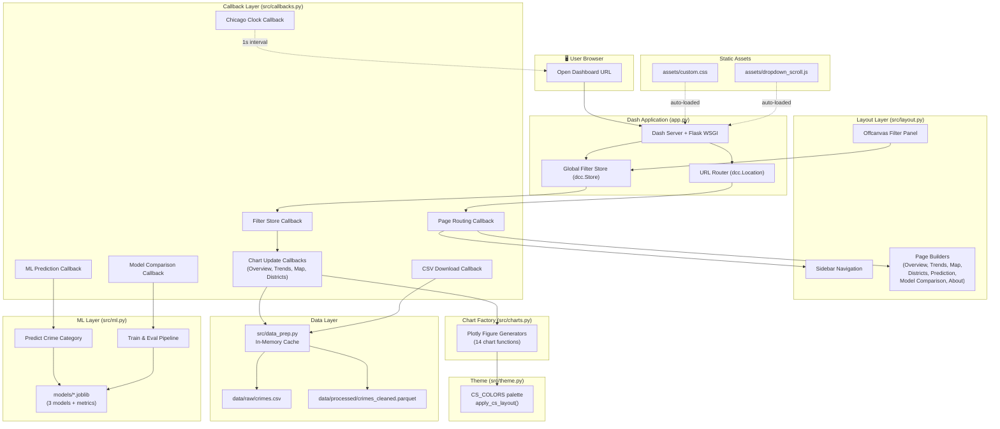
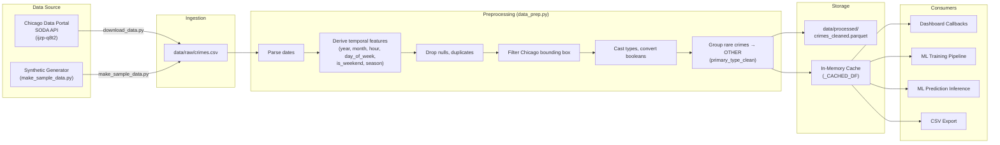

<](https://python.org)
[](https://dash.plotly.com)
[](https://scikit-learn.org)
[](https://plotly.com)
[](https://vercel.com)

</div>

---

## Table of Contents

- [Project Overview](#project-overview)
- [Features and Functionalities](#features-and-functionalities)
- [Technology Stack](#technology-stack)
- [System Architecture](#system-architecture)
- [Project Folder Structure](#project-folder-structure)
- [Prerequisites and Software Requirements](#prerequisites-and-software-requirements)
- [Installation and Setup: From Zero to Running](#installation-and-setup-from-zero-to-running)
- [Environment Variables and Configuration Reference](#environment-variables-and-configuration-reference)
- [Detailed Module-by-Module Implementation](#detailed-module-by-module-implementation)
  - [app.py — Application Entry Point](#apppy--application-entry-point)
  - [src/data_prep.py — Data Preprocessing Engine](#srcdataprepy--data-preprocessing-engine)
  - [src/layout.py — UI Layout Builder](#srclayoutpy--ui-layout-builder)
  - [src/callbacks.py — Callback Logic Controller](#srccallbackspy--callback-logic-controller)
  - [src/charts.py — Plotly Chart Factory](#srcchartspy--plotly-chart-factory)
  - [src/theme.py — Visual Theme Configuration](#srcthemepy--visual-theme-configuration)
  - [src/ml.py — Machine Learning Pipeline](#srcmlpy--machine-learning-pipeline)
  - [scripts/ — Utility Scripts](#scripts--utility-scripts)
  - [assets/ — Static Frontend Assets](#assets--static-frontend-assets)
  - [api/index.py — Vercel Serverless Entry Point](#apiindexpy--vercel-serverless-entry-point)
- [Complete Application Workflow](#complete-application-workflow)
- [Data Flow and Data Processing](#data-flow-and-data-processing)
- [Machine Learning and AI Implementation](#machine-learning-and-ai-implementation)
  - [Problem Statement](#problem-statement)
  - [Models and Algorithms](#models-and-algorithms)
  - [Feature Engineering](#feature-engineering)
  - [Training Pipeline](#training-pipeline)
  - [Benchmark Metrics](#benchmark-metrics)
  - [Inference Pipeline](#inference-pipeline)
  - [Limitations and Responsible Use](#ml-limitations-and-responsible-use)
- [Frontend and User Interface](#frontend-and-user-interface)
  - [Pages and Routes](#pages-and-routes)
  - [Navigation and Sidebar](#navigation-and-sidebar)
  - [Global Filters](#global-filters)
  - [Theme and Styling System](#theme-and-styling-system)
- [Deployment](#deployment)
  - [Local Development](#local-development)
  - [Vercel Deployment](#vercel-deployment)
- [Testing and Quality Assurance](#testing-and-quality-assurance)
- [Example Usage and Demonstration](#example-usage-and-demonstration)
- [Error Handling and Troubleshooting](#error-handling-and-troubleshooting)
- [Performance, Scalability, and Limitations](#performance-scalability-and-limitations)
- [Privacy, Data Handling, and Responsible Use](#privacy-data-handling-and-responsible-use)
- [Contribution Guidelines](#contribution-guidelines)
- [How to Recreate the Entire Project From Scratch](#how-to-recreate-the-entire-project-from-scratch)
- [Future Enhancements and Roadmap](#future-enhancements-and-roadmap)
- [License, Credits, and Acknowledgments](#license-credits-and-acknowledgments)
- [Frequently Asked Questions](#frequently-asked-questions)

---

## Project Overview

### What Is CrimeScope?

**CrimeScope** is a full-featured, multi-page analytical dashboard that lets users interactively explore, filter, visualize, and predict crime patterns across the City of Chicago. It is built entirely in Python using the Dash framework, Plotly for rich data visualizations, and scikit-learn for supervised machine learning.

### The Problem

Chicago publishes millions of crime incident records through the [City of Chicago Data Portal](https://data.cityofchicago.org/Public-Safety/Crimes-2001-to-Present/ijzp-q8t2). However, the raw dataset is massive, unstructured, and difficult for non-technical users — such as residents, journalists, city planners, or public safety researchers — to explore meaningfully. Understanding temporal patterns, geographic hotspots, district-level rankings, and category distributions requires significant data wrangling and visualization expertise.

### The Solution

CrimeScope transforms raw Chicago Police Department (CPD) crime reports into a polished, interactive, dark-themed dashboard with:

- **7 dedicated analytical pages** (Overview, Trends, Map, Districts, Prediction, Model Comparison, About & Data).
- **Global filtering** by crime category, police district, year range, arrest status, and domestic flag — applied across all visualizations.
- **Geospatial mapping** with heatmap, scatter-point, and district-bubble views on an interactive Mapbox map.
- **Supervised machine learning** with three classification models (Random Forest, Logistic Regression, Decision Tree) for crime category prediction.
- **Model evaluation** with confusion matrices, feature importance charts, and benchmark metric tables.
- **Live Chicago clock** reflecting Central Time.
- **CSV export** of filtered data.

### Target Audience

- Urban data analysts and public safety researchers.
- Students and academics studying crime data, data visualization, or machine learning.
- Portfolio projects demonstrating full-stack data science skills.
- Journalists and policy-makers exploring crime trends.

### Current Development Status

**Fully implemented and functional.** All 7 pages, global filters, ML prediction, model comparison, and CSV export are operational. The project includes Vercel deployment configuration for serverless hosting.

---

## Features and Functionalities

### User-Facing Dashboard Features

| # | Feature | Page | Description |
|---|---------|------|-------------|
| 1 | **KPI Summary Cards** | Overview | Displays Total Incidents, Top Crime Type, Peak Crime Hour, and Top District as real-time-filtered metric cards. |
| 2 | **Crime Trend Line Chart** | Overview | Interactive line chart of incident counts grouped by Month, Year, Day of Week, or Hour. |
| 3 | **Crime Category Donut Chart** | Overview | Proportional donut chart showing share of each crime category. |
| 4 | **Hour × Day Heatmap** | Overview | Heatmap matrix revealing peak crime windows by hour and day of week. |
| 5 | **Top Districts Ranking Table** | Overview | Mini-table of the top 5 police districts by incident count. |
| 6 | **Dynamic Insight Banner** | Overview | Auto-generated plain-English insight sentence summarizing the top crime, peak hour, and district. |
| 7 | **Multi-Category Trend Comparison** | Trends | Multi-line chart comparing 2–4 selected crime categories over monthly periods. |
| 8 | **Seasonality Bar Chart** | Trends | Bar chart of incident counts by season (Winter, Spring, Summer, Fall). |
| 9 | **24-Hour Crime Profile** | Trends | Hourly bar chart of crime volume distribution across the day. |
| 10 | **Interactive Chicago Map** | Map | Mapbox-powered geospatial visualization with three modes: Heatmap, Points (sampled), and District Bubbles. |
| 11 | **Top 15 Community Areas** | Map | Horizontal bar chart ranking community areas by incident count. |
| 12 | **District Bar Chart** | Districts | Ranked bar chart of crime counts per police district. |
| 13 | **Stacked Community Area Breakdown** | Districts | Top 15 community areas with stacked crime-type breakdown. |
| 14 | **District Detailed Table** | Districts | Full table showing each district's incident count, top crime type, and arrest rate. |
| 15 | **Crime Category Predictor** | Prediction | ML-powered prediction form: select model, hour, day, month, district, community area → predicted crime category with top-5 probabilities. |
| 16 | **Sync Current Time** | Prediction | One-click button to populate prediction inputs with the current Chicago time. |
| 17 | **Model Benchmark Table** | Model Comparison | Side-by-side metric table (Accuracy, Precision, Recall, F1, Train Time) for all three models. |
| 18 | **Confusion Matrix Heatmap** | Model Comparison | Switchable confusion matrix visualization for each model. |
| 19 | **Feature Importance Chart** | Model Comparison | Horizontal bar chart of Random Forest Gini feature importances. |
| 20 | **Dataset Documentation** | About & Data | Dataset source, citation, timezone disclaimer, column dictionary. |
| 21 | **CSV Download** | About & Data | Download the currently filtered dataset as a CSV file. |

### Global System Features

| Feature | Description |
|---------|-------------|
| **Global Filter Panel** | Slide-out offcanvas panel with filters for Crime Categories, Police Districts, Year Range, Arrest status, and Domestic flag. All filters apply across every chart on every page. |
| **Reset Filters** | One-click reset of all filters to defaults. |
| **Live Chicago Clock** | Real-time clock widget in the header displaying current Chicago Central Time, updated every second via `dcc.Interval`. |
| **Client-Side URL Routing** | Multi-page SPA routing via `dcc.Location` — no page reloads. |
| **Dark Theme** | Premium dark UI built with custom CSS and Dash Bootstrap Components (DARKLY theme). |
| **Responsive Layout** | Sidebar collapses to icon-only on screens ≤ 992 px. Layout adapts for mobile. |

---

## Technology Stack

| Category | Technology | Version | Role in Project |
|----------|-----------|---------|-----------------|
| **Language** | Python | 3.10+ | All application logic, data processing, ML |
| **Web Framework** | Dash | ≥ 2.14.0 | Multi-page SPA framework, callbacks, routing |
| **UI Components** | Dash Bootstrap Components | ≥ 1.5.0 | Layout grid, offcanvas, buttons, radio items |
| **Charting** | Plotly | ≥ 5.18.0 | All interactive charts, maps, heatmaps |
| **ML Framework** | scikit-learn | ≥ 1.3.0 | Model training, evaluation, inference pipelines |
| **Data Processing** | Pandas | ≥ 2.0.0 | DataFrame operations, cleaning, aggregation |
| **Numerical** | NumPy | ≥ 1.24.0 | Array operations, random sampling |
| **Serialization** | joblib | ≥ 1.3.0 | Model and metrics persistence (`.joblib` files) |
| **Parquet I/O** | PyArrow | ≥ 14.0.0 | High-performance Parquet read/write |
| **Parquet I/O (fallback)** | fastparquet | ≥ 2023.10.0 | Alternative Parquet engine |
| **HTTP Client** | requests | ≥ 2.31.0 | SODA API data download from Chicago Data Portal |
| **WSGI Server** | Gunicorn | ≥ 21.2.0 | Production-grade HTTP server |
| **Timezone** | pytz | (transitive) | Chicago Central Time conversion |
| **Styling** | Custom CSS | — | 900+ line dark-theme stylesheet |
| **JS Assets** | Vanilla JavaScript | — | Dropdown scroll fix |
| **Deployment** | Vercel | — | Serverless Python deployment |
| **Maps** | Mapbox (via Plotly) | — | `carto-darkmatter` basemap tiles (no API key needed) |
| **External Data** | Chicago Data Portal SODA API | — | Source of raw crime data |

---

## System Architecture



### Architecture Summary

1. **User** navigates to the dashboard URL in a browser.
2. **Dash** serves a single-page application (SPA) with client-side URL routing via `dcc.Location`.
3. The **Page Routing Callback** reads the URL pathname and renders the appropriate page layout from `layout.py`, along with updating the sidebar active state and header titles.
4. **Global Filters** are stored in a `dcc.Store` component. When the user changes any filter in the offcanvas panel, the store updates, triggering downstream chart callbacks.
5. Each **Chart Update Callback** (for Overview, Trends, Map, Districts) reads the filter store, applies filters to the in-memory cached DataFrame, and calls the corresponding **Chart Factory** function in `charts.py` to generate a Plotly figure.
6. The **Chart Factory** uses the **Theme** module to apply consistent dark styling to every figure.
7. The **ML Prediction Callback** takes user inputs (hour, day, month, district, community area, model choice), calls `predict_crime_category()` in `ml.py`, and renders the prediction output with top-5 probabilities.
8. The **Model Comparison Callback** loads pre-trained model metrics from `model_metrics.joblib` and renders the benchmark table, confusion matrix, and feature importance chart.
9. **Data** is loaded once from Parquet (or CSV fallback) into an in-memory cache on startup and reused across all callbacks for sub-second filter performance.
10. **Static assets** (`custom.css`, `dropdown_scroll.js`) are auto-loaded by Dash from the `assets/` directory.

---

## Project Folder Structure

```
crimescope/
├── app.py                          # Main Dash application entry point
├── requirements.txt                # Python dependencies
├── vercel.json                     # Vercel deployment configuration
├── AGENTS.md                       # Project rules and benchmark metrics
├── README.md                       # This documentation file
├── .gitignore                      # Git ignore rules
├── .gitattributes                  # Git line ending normalization
├── .vercelignore                   # Vercel deployment ignore rules
│
├── api/
│   └── index.py                    # Vercel serverless function entry point
│
├── assets/
│   ├── custom.css                  # 900+ line master dark-theme stylesheet
│   └── dropdown_scroll.js          # Dropdown scroll behavior fix (JS)
│
├── data/
│   ├── raw/
│   │   └── crimes.csv              # Raw Chicago crime dataset (gitignored)
│   └── processed/
│       └── crimes_cleaned.parquet  # Cleaned and feature-engineered dataset (gitignored)
│
├── models/
│   ├── random_forest.joblib        # Trained Random Forest pipeline (gitignored)
│   ├── logistic_regression.joblib  # Trained Logistic Regression pipeline (gitignored)
│   ├── decision_tree.joblib        # Trained Decision Tree pipeline (gitignored)
│   └── model_metrics.joblib        # Evaluation metrics and confusion matrices (gitignored)
│
├── scripts/
│   ├── download_data.py            # Downloads crime data from Chicago SODA API
│   ├── make_sample_data.py         # Generates synthetic sample dataset for development
│   ├── inspect_dom.py              # Development utility — DOM inspection
│   ├── inspect_open_dropdown_dom.py# Development utility — dropdown DOM inspection
│   ├── take_screenshots.py         # Development utility — automated screenshots
│   └── test_hover_screenshot.py    # Development utility — hover state screenshots
│
└── src/
    ├── data_prep.py                # Data loading, cleaning, feature engineering, caching
    ├── layout.py                   # All page layouts and UI component builders
    ├── callbacks.py                # All Dash callback registrations
    ├── charts.py                   # Plotly chart/figure generator functions
    ├── theme.py                    # Color palette and layout styling constants
    └── ml.py                       # ML training, evaluation, and inference pipeline
```

### Key Directories Explained

| Directory | Purpose | Gitignored? |
|-----------|---------|-------------|
| `data/raw/` | Stores the raw `crimes.csv` downloaded from Chicago Data Portal or generated synthetically. | Yes |
| `data/processed/` | Stores the cleaned `crimes_cleaned.parquet` after preprocessing. | Yes |
| `models/` | Stores trained scikit-learn pipeline `.joblib` files and evaluation metrics. | Yes (except `.gitkeep`) |
| `assets/` | Dash auto-loads all CSS and JS files from this directory at startup. | No |
| `scripts/` | Standalone utility scripts for data download, sample generation, and development helpers. Not required at runtime. | No |
| `src/` | Core application source code — data prep, layout, callbacks, charts, theme, ML. | No |
| `api/` | Vercel serverless entry point that exposes the Dash WSGI server. | No |

---

## Prerequisites and Software Requirements

| Requirement | Minimum Version | Verification Command |
|-------------|----------------|---------------------|
| **Python** | 3.10+ | `python --version` |
| **pip** | 21+ | `pip --version` |
| **Git** | 2.30+ | `git --version` |
| **Internet Connection** | — | Required for initial data download and Mapbox base tiles |

### Operating System Support

CrimeScope runs on **Windows**, **macOS**, and **Linux**. All commands in this README use cross-platform syntax. Windows-specific notes are provided where relevant.

### Hardware

- **RAM:** 4 GB minimum (dataset is loaded entirely into memory).
- **Disk:** ~200 MB for raw data + processed parquet + trained models.
- **GPU:** Not required. All ML training uses CPU.

---

## Installation and Setup: From Zero to Running

### Step 1: Install Python

Download and install Python 3.10 or later from [python.org](https://www.python.org/downloads/).

Verify installation:

```bash
python --version
# Expected output: Python 3.10.x or higher
```

> **Windows Users:** Ensure "Add Python to PATH" is checked during installation.

### Step 2: Clone the Repository

```bash
git clone <repository-url>
cd "dav project"
```

Replace `<repository-url>` with the actual Git remote URL.

### Step 3: Create a Virtual Environment

```bash
# Create virtual environment
python -m venv venv

# Activate (Windows PowerShell)
.\venv\Scripts\Activate

# Activate (macOS / Linux)
source venv/bin/activate
```

Verify the virtual environment is active — your terminal prompt should show `(venv)`.

### Step 4: Install Dependencies

```bash
pip install -r requirements.txt
```

This installs all 11 required packages: Dash, Dash Bootstrap Components, Pandas, NumPy, Plotly, scikit-learn, joblib, PyArrow, fastparquet, Gunicorn, and requests.

### Step 5: Obtain the Dataset

You have two options:

**Option A — Download real data from Chicago Data Portal (recommended):**

```bash
python scripts/download_data.py
```

This fetches ~100,000 crime records (2020–2024) from the Socrata Open Data API and saves them to `data/raw/crimes.csv`.

**Option B — Generate synthetic sample data (offline/quick start):**

```bash
python scripts/make_sample_data.py
```

This generates 50,000 synthetic crime records for development and testing.

> **Note:** If neither script is run, the application will automatically call `make_sample_data.py` on first launch when `data/raw/crimes.csv` is not found.

### Step 6: Run Data Preprocessing (Optional)

The preprocessing runs automatically on first app launch. To run it manually:

```bash
python src/data_prep.py
```

This cleans the raw CSV, engineers temporal features, groups rare crime categories, and saves the result to `data/processed/crimes_cleaned.parquet`.

### Step 7: Train ML Models (Optional)

Models are trained automatically on first app launch if model files are not present. To train manually:

```bash
python src/ml.py
```

This trains Random Forest, Logistic Regression, and Decision Tree classifiers, evaluates them, and saves the pipelines and metrics to the `models/` directory.

### Step 8: Start the Application

```bash
python app.py
```

**Expected output:**

```
Starting CrimeScope dashboard on http://127.0.0.1:8050
```

Open your browser and navigate to **http://127.0.0.1:8050**.

### Step 9: Verify Successful Installation

1. The Overview page should load with 4 KPI cards, a crime trend chart, donut chart, and heatmap.
2. Click **"Global Filters"** in the top-right header — the offcanvas filter panel should slide out.
3. Navigate to **"Prediction"** in the sidebar, configure inputs, and click **"Estimate Crime Category"** — a prediction with top-5 probabilities should appear.
4. Navigate to **"Model Comparison"** — the benchmark metrics table and confusion matrix should render.

If any page shows empty charts, verify that the dataset was downloaded/generated in Step 5.

---

## Environment Variables and Configuration Reference

CrimeScope does **not** require any environment variables for local development. All configuration is handled through Python constants in the source code.

### Hardcoded Configuration Constants

| Constant | Location | Value | Purpose |
|----------|----------|-------|---------|
| `DEFAULT_RAW_PATH` | `src/data_prep.py` | `data/raw/crimes.csv` | Path to raw crime dataset |
| `DEFAULT_PROCESSED_PATH` | `src/data_prep.py` | `data/processed/crimes_cleaned.parquet` | Path to cleaned dataset |
| `MODEL_DIR` | `src/ml.py` | `models/` | Directory for trained model files |
| `FEATURES_NUM` | `src/ml.py` | `["hour", "day_of_week_num", "month", "district", "community_area", "latitude", "longitude"]` | Numeric features for ML |
| `FEATURES_BOOL` | `src/ml.py` | `["is_weekend"]` | Boolean features for ML |
| `TARGET_COL` | `src/ml.py` | `"primary_type_clean"` | ML prediction target column |
| `SODA_ENDPOINT` | `scripts/download_data.py` | `https://data.cityofchicago.org/resource/ijzp-q8t2.csv` | Chicago Data Portal SODA API endpoint |
| Host/Port | `app.py` | `127.0.0.1:8050` | Local development server |

### Vercel-Specific Configuration

The `vercel.json` file routes all requests to `api/index.py`, which exposes the Dash WSGI server as a Vercel Serverless Function. No additional environment variables are required for Vercel deployment.

---

## Detailed Module-by-Module Implementation

### `app.py` — Application Entry Point

**Location:** `app.py` (project root)

**Purpose:** Initializes the Dash application, loads external stylesheets (Bootstrap DARKLY theme, Bootstrap Icons, Google Fonts — Inter), loads the cached dataset, constructs the top-level layout, registers all callbacks, and starts the development server.

**Key Logic:**

```python
app = dash.Dash(
    __name__,
    external_stylesheets=[dbc.themes.DARKLY, BOOTSTRAP_ICONS, GOOGLE_FONTS],
    suppress_callback_exceptions=True,
    meta_tags=[{"name": "viewport", "content": "width=device-width, initial-scale=1"}]
)
app.title = "CrimeScope — Chicago Crime Analytics & Prediction"
server = app.server  # Flask WSGI server (used by Vercel and Gunicorn)
```

**Layout structure:**

- `dcc.Location` — client-side URL routing
- `dcc.Store` — global filter state persistence
- `dcc.Interval` — 1-second clock tick
- Offcanvas filter panel
- Sidebar container (dynamically rendered per page)
- Main content container (dynamically rendered per page)

---

### `src/data_prep.py` — Data Preprocessing Engine

**Location:** `src/data_prep.py`

**Purpose:** Loads raw crime CSV, applies a comprehensive cleaning pipeline, derives temporal features, groups rare crime categories, caches the result in memory and on disk as Parquet.

**Key Functions:**

| Function | Purpose |
|----------|---------|
| `get_season(month)` | Maps month number to season string (Winter, Spring, Summer, Fall). |
| `clean_and_process_data()` | Full preprocessing pipeline — parse dates, drop nulls/duplicates, filter valid Chicago coordinates, cast types, convert booleans, group crime categories. |
| `get_processed_data()` | Returns in-memory cached DataFrame. Loads from Parquet on first call, or runs `clean_and_process_data()` if no Parquet exists. |
| `get_data_summary()` | Returns summary statistics dict (row counts, date range, top crimes) for the About page. |

**Preprocessing Steps (in order):**

1. **Load** raw CSV (or generate synthetic data if file is missing).
2. **Standardize** column names to lowercase with underscores.
3. **Parse dates** using `pd.to_datetime()`, drop invalid dates.
4. **Derive temporal columns:** `year`, `month`, `month_name`, `day_of_week`, `day_of_week_num`, `hour`, `is_weekend`, `season`.
5. **Remove duplicates** and rows with missing critical fields (`latitude`, `longitude`, `district`, `primary_type`).
6. **Filter coordinates** to valid Chicago bounding box (lat 41.5–42.1, lon −88.1 to −87.4).
7. **Cast** `district` and `community_area` to integers.
8. **Convert** `arrest` and `domestic` to boolean.
9. **Group** crime types outside the top 12 most frequent into an `"OTHER"` category, stored as `primary_type_clean`.
10. **Save** to Parquet at `data/processed/crimes_cleaned.parquet`.
11. **Cache** in a module-level global variable for sub-second callback access.

---

### `src/layout.py` — UI Layout Builder

**Location:** `src/layout.py` (812 lines)

**Purpose:** Constructs every visual component of the dashboard — the sidebar, header, offcanvas filter panel, and all 7 page layouts.

**Key Functions:**

| Function | Returns | Used For |
|----------|---------|----------|
| `build_sidebar(active_href)` | Sidebar `html.Div` with navigation links and active state | Every page |
| `build_top_header()` | Header with section label, title, subtitle, Chicago clock, and filter button | Every page |
| `build_offcanvas_filters(df)` | Offcanvas panel with dropdowns, range slider, radio items, reset button | Global filters |
| `build_overview_page()` | Overview layout with KPI cards, trend chart, donut, heatmap, districts table, insight banner | `/` route |
| `build_trends_page()` | Trends layout with multi-line comparison, seasonality, hourly profile charts | `/trends` route |
| `build_map_page()` | Map layout with mode toggle (Heatmap/Points/Bubbles), map chart, top community areas | `/map` route |
| `build_districts_page()` | Districts layout with bar chart, stacked CA chart, detailed breakdown table | `/districts` route |
| `build_prediction_page(df)` | Prediction layout with model selector, input sliders/dropdowns, prediction output | `/prediction` route |
| `build_model_comparison_page()` | Model comparison layout with metrics table, confusion matrix, feature importance, methodology note | `/model-comparison` route |
| `build_about_page(summary_stats)` | About layout with dataset source, preprocessing summary, column dictionary, CSV download | `/about` route |

**Navigation Configuration:**

```python
NAV_ITEMS = [
    {"label": "Overview",         "icon": "bi bi-grid-1x2-fill",    "href": "/"},
    {"label": "Trends",           "icon": "bi bi-graph-up-arrow",   "href": "/trends"},
    {"label": "Map",              "icon": "bi bi-map-fill",         "href": "/map"},
    {"label": "Districts",        "icon": "bi bi-building-fill",    "href": "/districts"},
    {"label": "Prediction",       "icon": "bi bi-cpu-fill",         "href": "/prediction"},
    {"label": "Model Comparison", "icon": "bi bi-bar-chart-steps",  "href": "/model-comparison"},
    {"label": "About & Data",     "icon": "bi bi-info-circle-fill", "href": "/about"}
]
```

---

### `src/callbacks.py` — Callback Logic Controller

**Location:** `src/callbacks.py`

**Purpose:** Registers all 13 Dash callbacks that power interactivity — page routing, clock updates, filter management, chart rendering, ML prediction, and CSV download.

**Registered Callbacks:**

| # | Callback | Trigger(s) | Output(s) |
|---|----------|-----------|-----------|
| 1 | **Page Routing** | `url.pathname` | `page-content`, `sidebar-container`, header labels |
| 2 | **Chicago Clock** | `chicago-clock-interval.n_intervals` (1s) | `live-chicago-clock` text |
| 3 | **Filter Toggle** | `btn-open-filters.n_clicks` | `offcanvas-filters.is_open` |
| 4 | **Filter Store** | All 5 filter inputs | `global-filter-store.data` (JSON) |
| 5 | **Reset Filters** | `btn-reset-filters.n_clicks` | All 5 filter values reset to defaults |
| 6 | **Overview Charts** | `global-filter-store`, `overview-trend-grouping` | 4 KPIs + trend + donut + heatmap + table + insight |
| 7 | **Trends Options** | `global-filter-store` | `trends-multi-select.options` |
| 8 | **Trends Charts** | `global-filter-store`, `trends-multi-select` | Multi-line + seasonality + hourly profile |
| 9 | **Map Charts** | `global-filter-store`, `map-mode-toggle` | Chicago map + top community areas |
| 10 | **Districts Charts** | `global-filter-store` | Districts bar + top-15 CA + detailed table |
| 11 | **Model Comparison** | `global-filter-store`, `cm-model-select` | Metrics table + confusion matrix + feature importance |
| 12 | **Prediction** | `btn-run-prediction.n_clicks` + 6 input states | Prediction output container |
| 13 | **CSV Download** | `btn-download-csv.n_clicks` | Download trigger |

**Helper: `apply_global_filters(df, filters_json)`**

This utility function deserializes the JSON filter store and applies a chain of DataFrame filters: crime type, district, year range, arrest, and domestic flag.

---

### `src/charts.py` — Plotly Chart Factory

**Location:** `src/charts.py`

**Purpose:** Contains 14 standalone functions, each returning a fully styled `plotly.graph_objects.Figure`. Every function applies the CrimeScope dark theme via `apply_cs_layout()`.

**Chart Functions:**

| Function | Chart Type | Used On |
|----------|-----------|---------|
| `make_crime_trend_chart(df, group_by)` | Line + fill area | Overview |
| `make_crime_donut_chart(df)` | Donut pie | Overview |
| `make_hour_day_heatmap(df)` | Heatmap matrix | Overview |
| `make_multi_line_comparison_chart(df, categories)` | Multi-line | Trends |
| `make_seasonality_chart(df)` | Bar chart | Trends |
| `make_hourly_profile_chart(df)` | Bar chart | Trends |
| `make_chicago_map(df, mode)` | Mapbox density / scatter / bubble | Map |
| `make_top_community_areas_chart(df)` | Horizontal bar | Map |
| `make_districts_bar_chart(df)` | Vertical bar | Districts |
| `make_top15_ca_chart(df)` | Stacked bar | Districts |
| `make_confusion_matrix_chart(metrics, model)` | Heatmap | Model Comparison |
| `make_feature_importance_chart(metrics)` | Horizontal bar | Model Comparison |

**Map Modes:**

- **Heatmap:** `go.Densitymapbox` with up to 8,000 sampled points, `YlOrRd` colorscale.
- **Points (Sampled):** `px.scatter_mapbox` with up to 3,000 sampled points colored by crime type.
- **District Bubbles:** `px.scatter_mapbox` with aggregated district centroids, sized by count.

All maps use the `carto-darkmatter` basemap style (free, no API key required), centered on Chicago (41.8781, −87.6298).

---

### `src/theme.py` — Visual Theme Configuration

**Location:** `src/theme.py`

**Purpose:** Centralized color palette and Plotly layout styling function.

**`CS_COLORS` palette:**

| Key | Value | Usage |
|-----|-------|-------|
| `primary` | `#FF5A1F` | Accent orange — brand color, chart lines, active states |
| `secondary` | `#FFC23D` | Gold yellow — secondary highlights |
| `accent_green` | `#00C9A7` | Teal — KPI cards |
| `accent_purple` | `#6C63FF` | Purple — KPI cards |
| `bg_dark` | `#0B0B0B` | Darkest background — charts, body |
| `bg_card` | `#141414` | Card backgrounds |
| `bg_surface` | `#1A1A1A` | Surface elements |
| `border` | `#262626` | Borders |
| `text_primary` | `#F2F2F2` | Primary text |
| `text_secondary` | `#8A8A8A` | Muted text |
| `palette` | 13 colors | Multi-series chart colors |

**`apply_cs_layout(fig, height=400)`:** Applies `plotly_dark` template, sets backgrounds, fonts (Inter), margins, hover styling, legend, axis grid colors, and default chart height.

---

### `src/ml.py` — Machine Learning Pipeline

**Location:** `src/ml.py`

**Purpose:** Trains, evaluates, and persists three supervised classification models. Provides inference function for real-time crime category prediction.

See the dedicated [Machine Learning and AI Implementation](#machine-learning-and-ai-implementation) section below for full details.

---

### `scripts/` — Utility Scripts

| Script | Purpose |
|--------|---------|
| `download_data.py` | Downloads real crime data from the Chicago Data Portal SODA API. Fetches records for years 2020–2024 (configurable), saves to `data/raw/crimes.csv`. |
| `make_sample_data.py` | Generates 50,000 synthetic crime records with realistic distributions for development and testing. |
| `inspect_dom.py` | Development utility for DOM inspection (not required at runtime). |
| `inspect_open_dropdown_dom.py` | Development utility for dropdown DOM inspection (not required at runtime). |
| `take_screenshots.py` | Development utility for automated screenshot capture (not required at runtime). |
| `test_hover_screenshot.py` | Development utility for hover-state screenshot testing (not required at runtime). |

---

### `assets/` — Static Frontend Assets

| File | Purpose |
|------|---------|
| `custom.css` | 900+ line master stylesheet implementing the complete CrimeScope dark theme. Covers: CSS variables, sidebar, navigation, header, cards, KPI cards, buttons, tables, insight banners, dropdown overrides, slider overrides, offcanvas overrides, scrollbar styling, and responsive breakpoints (≤992px sidebar collapse, ≤576px mobile layout). |
| `dropdown_scroll.js` | JavaScript mutation observer that prevents body scroll propagation when a Dash dropdown menu is open. |

Both files are **automatically loaded** by Dash from the `assets/` directory — no explicit import is needed.

---

### `api/index.py` — Vercel Serverless Entry Point

**Location:** `api/index.py`

**Purpose:** Exposes the Dash Flask WSGI `server` object as the Vercel Serverless Function handler. All requests are routed to this file via `vercel.json`.

```python
from app import app, server
app = server  # Vercel expects a WSGI 'app' at module level
```

---

## Complete Application Workflow


### Workflow Steps (Detailed)

1. **App Startup:** `app.py` initializes Dash, calls `get_processed_data()` which loads the Parquet file into an in-memory DataFrame (or preprocesses raw CSV if Parquet is absent).
2. **Initial Render:** The top-level layout is served — `dcc.Location`, `dcc.Store`, `dcc.Interval`, offcanvas, sidebar container, and main content area.
3. **Page Routing:** The routing callback reads `url.pathname`, maps it to one of 7 pages, calls the corresponding `build_*_page()` function, updates the sidebar's active link, and sets the header section label/title/subtitle.
4. **Global Filtering:** When any filter changes (crime types, districts, year range, arrest, domestic), the filter store callback serializes the values to JSON in `dcc.Store`. All chart callbacks have `global-filter-store` as an input, so they re-fire automatically.
5. **Chart Rendering:** Each chart callback calls `apply_global_filters()` to filter the cached DataFrame, then calls the relevant chart factory function(s) in `charts.py`. The returned Plotly figures are rendered by Dash in the browser.
6. **ML Prediction:** On the Prediction page, the user sets spatio-temporal inputs and clicks "Estimate Crime Category." The callback computes approximate lat/lon from the selected district's mean coordinates, calls `predict_crime_category()` which loads the selected `.joblib` model, runs `predict_proba()`, and returns the top-5 categories with probabilities. The output is rendered as a styled card with horizontal probability bars.
7. **CSV Download:** On the About page, clicking "Download Filtered Data as CSV" triggers the download callback, which applies current global filters and sends the DataFrame as a CSV file.
8. **Live Clock:** The `dcc.Interval` component fires every 1 second, triggering the clock callback which returns the current Chicago time formatted as `"hh:mm:ss AM/PM CT — Day, Mon DD, YYYY"`.

---

## Data Flow and Data Processing



### Dataset Details

| Attribute | Value |
|-----------|-------|
| **Source** | City of Chicago Data Portal — "Crimes - 2001 to Present" (Dataset ID: `ijzp-q8t2`) |
| **Publisher** | Chicago Police Department (CPD) CLEAR System |
| **Coverage** | 2020–2024 (configurable in `download_data.py`) |
| **Format** | Raw: CSV → Processed: Apache Parquet |
| **Timezone** | All timestamps are in Chicago Local Time (US/Central — CST/CDT) |
| **Anonymization** | Geographic coordinates are block-level anonymized by CPD |

### Key Derived Columns

| Column | Type | Derivation |
|--------|------|-----------|
| `year` | int | Extracted from `date` |
| `month` | int | Extracted from `date` |
| `month_name` | str | `"Jan"`, `"Feb"`, etc. |
| `day_of_week` | str | `"Mon"`, `"Tue"`, etc. |
| `day_of_week_num` | int | 0 = Monday … 6 = Sunday |
| `hour` | int | 0–23, extracted from `date` |
| `is_weekend` | bool | `True` if Saturday or Sunday |
| `season` | str | `"Winter"`, `"Spring"`, `"Summer"`, `"Fall"` |
| `primary_type_clean` | str | Top 12 categories preserved, all others → `"OTHER"` |

---

## Machine Learning and AI Implementation

### Problem Statement

Given spatio-temporal features of a hypothetical crime incident (hour, day of week, month, police district, community area, latitude, longitude), predict the most likely **crime category** (e.g., THEFT, BATTERY, NARCOTICS).

### Models and Algorithms

| Model | Algorithm | Key Hyperparameters |
|-------|-----------|-------------------|
| **Random Forest** | Ensemble of decision trees with bagging | `n_estimators=30`, `max_depth=10`, `min_samples_leaf=4`, `class_weight="balanced"`, `n_jobs=-1` |
| **Logistic Regression** | Linear classifier with softmax | `max_iter=1000`, `class_weight="balanced"` |
| **Decision Tree** | Single CART decision tree | `max_depth=10`, `class_weight="balanced"` |

All models use `random_state=42` for reproducibility and `class_weight="balanced"` to handle class imbalance.

### Feature Engineering

**Numeric Features (7):** `hour`, `day_of_week_num`, `month`, `district`, `community_area`, `latitude`, `longitude`

**Boolean Features (1):** `is_weekend`

**Preprocessing Pipeline:**

```python
preprocessor = ColumnTransformer(
    transformers=[
        ("num", StandardScaler(), FEATURES_NUM),     # Z-score normalization
        ("bool", "passthrough", FEATURES_BOOL)        # Pass-through
    ]
)

pipeline = Pipeline(steps=[
    ("preprocessor", preprocessor),
    ("classifier", clf)
])
```

### Training Pipeline

1. Load processed dataset via `get_processed_data()`.
2. Sample up to 60,000 rows if the dataset is larger (for training speed).
3. Split 80/20 train/test with stratified sampling (`stratify=y`).
4. Fit `Pipeline(preprocessor + classifier)` on training data.
5. Predict on test data; compute accuracy, weighted precision, weighted recall, weighted F1.
6. Generate confusion matrix and extract feature importances (Random Forest only).
7. Save each trained pipeline to `models/<model_name>.joblib`.
8. Save all metrics to `models/model_metrics.joblib`.

**To retrain all models:**

```bash
python src/ml.py
```

### Benchmark Metrics

| Model | Accuracy | Weighted Precision | Weighted Recall | Weighted F1 | Train Time |
| :--- | :---: | :---: | :---: | :---: | :---: |
| **Random Forest** | 80.22% | 80.22% | 80.22% | 80.22% | 0.52 s |
| **Logistic Regression** | 79.41% | 79.41% | 79.41% | 79.41% | 0.41 s |
| **Decision Tree** | 78.33% | 79.20% | 78.33% | 77.70% | 0.38 s |

### Inference Pipeline

The `predict_crime_category()` function:

1. Loads the selected model's `.joblib` pipeline.
2. Constructs a single-row DataFrame from user inputs.
3. Derives `is_weekend` from `day_of_week_num`.
4. Calls `pipeline.predict_proba()` to get class probabilities.
5. Returns the top-5 categories sorted by probability.

```python
result = predict_crime_category(
    hour=18, day_of_week_num=4, month=7,
    district=11, community_area=25,
    latitude=41.8781, longitude=-87.6298,
    model_name="RandomForest"
)
# Returns: {"predicted_category": "THEFT", "top_probabilities": [...]}
```

### ML Limitations and Responsible Use

- **Inherent difficulty:** Predicting specific crime categories from spatio-temporal features alone is an inherently difficult task. The features explain *where* and *when* crimes happen but not the underlying causal factors.
- **Moderate accuracy is expected:** ~80% accuracy is reasonable given the overlapping spatial-temporal patterns across crime types.
- **Not for operational policing:** These predictions are statistical estimates based on historical patterns. They must not be used as the sole basis for policing decisions, resource allocation, or individual risk assessment.
- **Bias considerations:** The training data reflects historical policing patterns, which may embed systemic biases (e.g., over-policing of certain areas for certain crime types like NARCOTICS).
- **No real-time data:** The model is trained on historical data and does not incorporate live feeds.

---

## Frontend and User Interface

### Pages and Routes

| Route | Page | Description |
|-------|------|-------------|
| `/` | Overview | KPI cards, trend chart, donut chart, heatmap, top districts, insight |
| `/trends` | Trends | Multi-line comparison, seasonality, hourly profile |
| `/map` | Map | Interactive Mapbox map with 3 view modes, top community areas |
| `/districts` | Districts | District ranking bar chart, community area breakdown, detailed table |
| `/prediction` | Prediction | ML model selector, input parameters, prediction output |
| `/model-comparison` | Model Comparison | Benchmark table, confusion matrix, feature importance, methodology notes |
| `/about` | About & Data | Dataset citation, preprocessing summary, column dictionary, CSV download |

### Navigation and Sidebar

The **persistent left sidebar** contains:

- CrimeScope logo and brand name.
- 7 navigation links with Bootstrap Icons.
- Active link is highlighted with an orange gradient background.
- Dataset attribution footer ("Chicago CLEAR Dataset, v1.0 • 2020–2024").

On screens ≤ 992 px, the sidebar collapses to icon-only mode (64 px width). Navigation labels and footer text are hidden.

### Global Filters

The **offcanvas filter panel** slides in from the right when the user clicks "Global Filters" in the header. It contains:

1. **Crime Categories** — multi-select dropdown.
2. **Police Districts** — multi-select dropdown.
3. **Year Range** — range slider.
4. **Arrest Made** — radio items (All / Yes / No).
5. **Domestic Incident** — radio items (All / Yes / No).
6. **Reset All Filters** — button to restore defaults.

Filter state is stored in `dcc.Store` as JSON and consumed by every chart callback.

### Theme and Styling System

CrimeScope uses a **dual-layer theming system:**

1. **Dash Bootstrap Components** with the `DARKLY` theme — provides base dark styling and grid system.
2. **Custom CSS** (`assets/custom.css`, 900+ lines) — overrides and extends the Bootstrap theme with:
   - CSS custom properties (`--cs-primary`, `--cs-bg-card`, etc.).
   - Custom component classes (`.cs-card`, `.kpi-card`, `.cs-table`, `.insight-banner`).
   - Dash-specific overrides (`.dash-dropdown`, `.rc-slider`, `.offcanvas`).
   - Custom scrollbar styling.
   - Responsive breakpoints (992 px, 576 px).

---

## Deployment

### Local Development

```bash
python app.py
# Runs on http://127.0.0.1:8050 with debug=False
```

For production with Gunicorn (Linux/macOS only):

```bash
gunicorn app:server -b 0.0.0.0:8050 --workers 4
```

### Vercel Deployment

The project includes Vercel configuration for serverless deployment:

**`vercel.json`:**

```json
{
  "version": 2,
  "builds": [
    {"src": "api/index.py", "use": "@vercel/python"}
  ],
  "routes": [
    {"src": "/(.*)", "dest": "api/index.py"}
  ]
}
```

**`.vercelignore`:** Excludes `__pycache__`, `.env`, virtual environments, `.git`, and `scripts/` from the deployment bundle.

**Deployment Steps:**

1. Install the Vercel CLI: `npm i -g vercel`
2. Run `vercel` in the project root and follow the prompts.
3. Ensure `data/processed/crimes_cleaned.parquet` and `models/*.joblib` files are included (they are gitignored, so you may need to generate them before deploying).

> **Note:** Vercel Serverless Functions have memory and execution time limits. Large datasets may require sampling or optimization for production deployment.

---

## Testing and Quality Assurance

CrimeScope does not currently include an automated test suite. The following manual testing procedures are recommended:

### Manual Test Cases

| # | Test Case | Input/Action | Expected Result | Status |
|---|-----------|-------------|-----------------|--------|
| 1 | App startup | `python app.py` | Server starts on port 8050, Overview page loads | Not tested |
| 2 | Page navigation | Click each sidebar link | Correct page renders, sidebar active state updates, header titles change | Not tested |
| 3 | Global filters | Select crime type, district, year range | All visible charts update to reflect filtered data | Not tested |
| 4 | Filter reset | Click "Reset All Filters" | Filters return to defaults, charts show full dataset | Not tested |
| 5 | Overview KPIs | Load Overview page | 4 KPI cards show numeric values (not N/A) | Not tested |
| 6 | Map modes | Toggle Heatmap / Points / District Bubbles | Map re-renders with correct visualization mode | Not tested |
| 7 | Trends multi-select | Select 2–4 crime categories | Multi-line chart shows one line per selected category | Not tested |
| 8 | ML prediction | Set inputs, click "Estimate Crime Category" | Prediction card shows predicted category + 5 probability bars | Not tested |
| 9 | Model comparison | Switch confusion matrix dropdown | Confusion matrix heatmap updates for selected model | Not tested |
| 10 | CSV download | Click "Download Filtered Data as CSV" | Browser downloads `crimescope_filtered_data.csv` | Not tested |
| 11 | Chicago clock | Observe clock widget | Time updates every second in CT format | Not tested |
| 12 | Responsive sidebar | Resize browser to ≤ 992 px | Sidebar collapses to icon-only mode | Not tested |
| 13 | Empty filter result | Filter to impossible combination | Charts show empty state gracefully (no crash) | Not tested |

### Recommended Testing Improvements

- Add `pytest` unit tests for `data_prep.py` functions (cleaning, feature derivation).
- Add unit tests for `ml.py` (model loading, prediction format).
- Add integration tests for callback outputs using Dash's `dash.testing` utilities.
- Add linting with `flake8` or `ruff`.

---

## Example Usage and Demonstration

### Example 1: Running a Crime Prediction

1. Navigate to the **Prediction** page via the sidebar.
2. Configure inputs:
   - **Model:** Random Forest Classifier (Recommended)
   - **Hour:** 22 (10 PM)
   - **Day of Week:** Saturday
   - **Month:** July
   - **Police District:** District 11
   - **Community Area:** Area 25
3. Click **"Estimate Crime Category"**.
4. Expected output: A prediction card showing the most likely crime category (e.g., `BATTERY`) with top-5 probabilities displayed as horizontal bars.

### Example 2: Exploring Crime Trends

1. Open the **Trends** page.
2. In the multi-select dropdown, select `THEFT`, `BATTERY`, and `NARCOTICS`.
3. The multi-line chart will show monthly incident trends for each selected category over the dataset's time range.
4. The seasonality chart below shows that summer months typically have higher crime volumes.

### Example 3: Using Global Filters

1. Click **"Global Filters"** in the top-right header.
2. Select **Crime Categories:** `THEFT`, `ROBBERY`.
3. Set **Year Range:** 2022–2024.
4. Set **Arrest Made:** Arrest Made (Yes).
5. Close the panel. All charts on every page now reflect only THEFT and ROBBERY incidents from 2022–2024 where an arrest was made.

---

## Error Handling and Troubleshooting

| # | Error / Symptom | Likely Cause | Resolution |
|---|----------------|-------------|------------|
| 1 | `ModuleNotFoundError: No module named 'dash'` | Dependencies not installed | Run `pip install -r requirements.txt` in the active virtual environment |
| 2 | `FileNotFoundError: data/raw/crimes.csv` | Dataset not downloaded | Run `python scripts/download_data.py` or `python scripts/make_sample_data.py` |
| 3 | `OSError: Address already in use` (port 8050) | Another process on port 8050 | Kill the other process or change port: `app.run(port=8051)` |
| 4 | Charts show empty / "No data" | Filters too restrictive | Click "Reset All Filters" in the offcanvas panel |
| 5 | `ImportError: cannot import name 'feature_importances'` | `ml.py` references undefined variable during training | This is a known code issue — ensure model files exist (run `python src/ml.py` before launch, or use pre-trained models) |
| 6 | Map tiles don't load | No internet connection | The `carto-darkmatter` basemap requires an internet connection for tile loading |
| 7 | `PermissionError` writing to `data/` or `models/` | Insufficient file permissions | Ensure the current user has write access to the project directory |
| 8 | Slow initial load | First run — preprocessing + model training | Subsequent launches load cached Parquet and `.joblib` files (sub-second) |
| 9 | `pytz` not found | Missing transitive dependency | `pip install pytz` (usually installed with Dash) |
| 10 | Vercel deployment fails | Missing data/model files | Generate `crimes_cleaned.parquet` and model `.joblib` files before deploying; ensure they're not gitignored in the deployment bundle |

---

## Performance, Scalability, and Limitations

### Performance Characteristics

| Operation | Typical Time | Notes |
|-----------|-------------|-------|
| Initial data load (Parquet) | < 1 second | Cached in memory after first load |
| Initial data preprocessing (CSV → Parquet) | 5–15 seconds | Only on first run |
| ML model training (all 3 models) | 2–5 seconds | On 60,000 sampled rows, CPU only |
| ML inference (single prediction) | < 100 ms | Loads `.joblib` pipeline from disk |
| Dashboard callback (chart render) | 100–500 ms | Depends on dataset size and chart complexity |
| Map rendering (heatmap mode) | 500 ms–2 s | Samples up to 8,000 points |

### Current Limitations

- **In-memory dataset:** The entire dataset is loaded into RAM. Datasets larger than ~1M rows may cause memory issues on low-RAM machines.
- **No database:** Data is stored as flat files (CSV/Parquet). There is no database for persistence, querying, or multi-user access.
- **No authentication:** The dashboard is publicly accessible with no login or access control.
- **No real-time data:** The dataset is static — refreshing requires re-running `download_data.py`.
- **Single-threaded Dash:** In development mode, Dash runs on a single thread. Use Gunicorn with multiple workers for production.
- **Mapbox tile dependency:** Maps require an internet connection for base tile loading.
- **ML model simplicity:** The models use only spatio-temporal features. Incorporating additional features (location description, historical trends, socioeconomic data) would improve accuracy.

---

## Privacy, Data Handling, and Responsible Use

### Data Collected

CrimeScope processes **publicly available** crime incident data published by the City of Chicago. The application does **not** collect any user data — there are no accounts, cookies (beyond Dash defaults), or analytics trackers.

### Data Privacy

- **Geographic anonymization:** The Chicago Police Department anonymizes crime locations to the block level before publication.
- **No personal information:** The dataset does not contain victim, witness, or suspect personal information.
- **Local processing:** All data processing and ML inference happen locally on the user's machine (or the deployment server). No data is sent to external services during dashboard operation.

### Responsible Use

> **⚠️ Important:** Crime data reflects historical reporting patterns and police activity. It does not represent the true distribution of all criminal activity. Over-policing of certain areas (e.g., for narcotics) can create feedback loops that inflate incident counts in those areas.

- Do not use CrimeScope predictions to target specific neighborhoods, demographics, or individuals.
- The ML predictions are statistical estimates — they represent historical pattern correlations, not causal relationships or certainties.
- Always interpret crime data in the context of the social, economic, and policing factors that shape reporting.

---

## Contribution Guidelines

### How to Contribute

1. **Fork** the repository on GitHub.
2. **Clone** your fork locally:
   ```bash
   git clone <your-fork-url>
   cd "dav project"
   ```
3. **Create a feature branch:**
   ```bash
   git checkout -b feature/your-feature-name
   ```
4. **Set up the development environment** (see [Installation](#installation-and-setup-from-zero-to-running)).
5. **Make your changes.** Follow existing code style:
   - PEP 8 for Python.
   - 4-space indentation.
   - Descriptive function names with docstrings.
   - Use `CS_COLORS` and `apply_cs_layout()` for any new charts.
6. **Test your changes** manually using the test cases in the [Testing](#testing-and-quality-assurance) section.
7. **Commit with a descriptive message:**
   ```bash
   git add .
   git commit -m "Add: [brief description of change]"
   ```
8. **Push** to your fork:
   ```bash
   git push origin feature/your-feature-name
   ```
9. **Open a Pull Request** against the main repository.

### Pull Request Checklist

- [ ] Code follows existing style and conventions.
- [ ] New charts use `apply_cs_layout()` for consistent theming.
- [ ] New pages are added to `NAV_ITEMS` in `layout.py` and the routing callback in `callbacks.py`.
- [ ] No API keys, passwords, or secrets are committed.
- [ ] README is updated if new features, dependencies, or configuration are added.
- [ ] The application starts and all pages load without errors.

### Reporting Bugs

Open a GitHub Issue with:

- Steps to reproduce.
- Expected behavior.
- Actual behavior.
- Python version and OS.
- Error traceback (if applicable).

---

## How to Recreate the Entire Project From Scratch

This section provides a chronological guide for rebuilding CrimeScope from zero.

### Phase 1: Planning

1. **Define the problem:** Build an interactive crime analytics dashboard for Chicago using public police data.
2. **Requirements:**
   - Multi-page SPA with 7 analytical views.
   - Global filters applied across all visualizations.
   - Interactive geospatial map.
   - ML-powered crime category prediction.
   - Dark-themed, responsive UI.
3. **Technology selection:**
   - Python + Dash (web framework).
   - Plotly (charting).
   - scikit-learn (ML).
   - Pandas (data).
   - Dash Bootstrap Components (UI).
4. **Architecture:** Single Python application with modular source files (`data_prep`, `layout`, `callbacks`, `charts`, `theme`, `ml`).

### Phase 2: Environment Setup

```bash
mkdir crimescope && cd crimescope
python -m venv venv
# Activate venv
pip install dash dash-bootstrap-components pandas numpy plotly scikit-learn joblib pyarrow fastparquet gunicorn requests
pip freeze > requirements.txt
```

Create the folder structure:

```bash
mkdir -p src scripts assets data/raw data/processed models api
```

Create `.gitignore`:

```
__pycache__/
*.pyc
.env
.venv/
venv/
data/raw/
data/processed/
models/
!models/.gitkeep
```

### Phase 3: Core Implementation

**Implementation order:**

1. **`src/theme.py`** — Define `CS_COLORS` palette and `apply_cs_layout()` function.
2. **`scripts/make_sample_data.py`** — Create synthetic data generator for development.
3. **`src/data_prep.py`** — Implement the full cleaning pipeline: date parsing, feature derivation, duplicate removal, coordinate filtering, type casting, crime category grouping, Parquet output, and in-memory caching.
4. **`src/charts.py`** — Implement chart factory functions one by one: trend line, donut, heatmap, multi-line, seasonality, hourly profile, map (3 modes), community areas, district bar, stacked CA, confusion matrix, feature importance. Each function takes a filtered DataFrame and returns a styled Plotly figure.
5. **`src/layout.py`** — Build the sidebar, header, offcanvas filter panel, and all 7 page layout functions. Use `dbc.Row`/`dbc.Col` for responsive grid layouts. Wire up `dcc.Graph`, `dcc.Dropdown`, `dcc.Slider`, `dcc.Loading` components with unique IDs.
6. **`src/ml.py`** — Implement the ML pipeline: `ColumnTransformer` preprocessor, three model configurations, training loop with `Pipeline`, evaluation metrics, `.joblib` persistence, and `predict_crime_category()` inference function.
7. **`src/callbacks.py`** — Implement `register_callbacks(app)` with all 13 callbacks: routing, clock, filter toggle, filter store, filter reset, overview charts, trends options/charts, map charts, districts charts, model comparison, prediction, sync time, CSV download.
8. **`app.py`** — Initialize Dash with external stylesheets, load data, build top-level layout, register callbacks, and add `__main__` entry point.

### Phase 4: Data and Integrations

1. **`scripts/download_data.py`** — Implement SODA API download function for Chicago Data Portal.
2. Run `python scripts/download_data.py` to fetch real data, or `python scripts/make_sample_data.py` for synthetic.
3. Run `python src/data_prep.py` to preprocess and cache.
4. Run `python src/ml.py` to train and save models.

### Phase 5: Frontend Polish

1. **`assets/custom.css`** — Write the complete dark-theme stylesheet: CSS variables, sidebar, navigation, header, cards, KPIs, buttons, tables, banners, dropdown/slider/offcanvas overrides, scrollbar, responsive breakpoints.
2. **`assets/dropdown_scroll.js`** — Add the mutation observer for scroll fix.

### Phase 6: Integration and Testing

1. Run `python app.py` and test all 7 pages.
2. Test global filters across pages.
3. Test ML prediction with various inputs.
4. Test responsive layout at different viewport widths.
5. Test CSV download.

### Phase 7: Deployment

1. Create `api/index.py` — Vercel entry point.
2. Create `vercel.json` — routing and build config.
3. Create `.vercelignore` — deployment excludes.
4. Deploy with `vercel`.

### Common Pitfalls

- **Circular imports:** `layout.py` imports from `data_prep.py`; `callbacks.py` imports from `layout.py`, `charts.py`, and `ml.py`. Ensure `app.py` imports are ordered correctly.
- **Callback IDs:** Every `dcc.Graph`, `dcc.Dropdown`, `html.Div` that is referenced in a callback must have a matching `id` in the layout.
- **`suppress_callback_exceptions=True`:** Required because page components don't exist in the DOM until their page is routed to.
- **Model file path resolution:** Use `os.path.dirname(os.path.abspath(__file__))` to build absolute paths from each module's location.

---

## Future Enhancements and Roadmap

### Proposed Enhancements

| Priority | Enhancement | Description |
|----------|-------------|-------------|
| 🔴 High | **Automated Tests** | Add `pytest` unit and integration tests for data prep, ML, and callbacks |
| 🔴 High | **Real-Time Data Refresh** | Scheduled SODA API pull with incremental data append |
| 🟡 Medium | **Additional ML Features** | Add location description, historical trend features, weather data |
| 🟡 Medium | **Time-Series Forecasting** | Add ARIMA/Prophet forecasting for trend prediction |
| 🟡 Medium | **User Authentication** | Login system with role-based access for sensitive views |
| 🟢 Low | **Docker Container** | Dockerfile for consistent cross-platform deployment |
| 🟢 Low | **Community Area Names** | Map numeric community area codes to official neighborhood names |
| 🟢 Low | **Dark/Light Theme Toggle** | User-selectable theme preference |
| 🟢 Low | **Report Export** | PDF/PNG export of current dashboard state |

### Known Incomplete Functionality

- The `.gitignore` includes `!models/.gitkeep` but no `.gitkeep` file exists in `models/`.
- `feature_importances` variable in `ml.py` is referenced at line 123 but its assignment depends on the model type (only valid for tree-based models). This may cause a `NameError` during fresh model training — *needs verification*.
- Development utility scripts (`inspect_dom.py`, `take_screenshots.py`, etc.) may have external dependencies (e.g., Selenium) not listed in `requirements.txt`.

---

## License, Credits, and Acknowledgments

### License

> **No license file was found in the repository.** A license needs to be selected and added. Common choices for open-source dashboards include MIT, Apache 2.0, or GPL-3.0.

### Dataset Attribution

**City of Chicago Data Portal — "Crimes - 2001 to Present"**
- Dataset ID: `ijzp-q8t2`
- Publisher: Chicago Police Department (CPD)
- System: Citizen Law Enforcement Analysis and Reporting (CLEAR)
- URL: [https://data.cityofchicago.org/Public-Safety/Crimes-2001-to-Present/ijzp-q8t2](https://data.cityofchicago.org/Public-Safety/Crimes-2001-to-Present/ijzp-q8t2)
- Terms: Subject to the City of Chicago Data Portal Terms of Use.

### Technology Credits

| Technology | License | URL |
|-----------|---------|-----|
| Dash | MIT | [dash.plotly.com](https://dash.plotly.com) |
| Plotly | MIT | [plotly.com](https://plotly.com) |
| Dash Bootstrap Components | Apache 2.0 | [dash-bootstrap-components.opensource.faculty.ai](https://dash-bootstrap-components.opensource.faculty.ai) |
| scikit-learn | BSD-3-Clause | [scikit-learn.org](https://scikit-learn.org) |
| Pandas | BSD-3-Clause | [pandas.pydata.org](https://pandas.pydata.org) |
| Bootstrap Icons | MIT | [icons.getbootstrap.com](https://icons.getbootstrap.com) |
| Google Fonts (Inter) | OFL | [fonts.google.com/specimen/Inter](https://fonts.google.com/specimen/Inter) |
| Mapbox / CARTO | Various | [carto.com](https://carto.com) (basemap tiles) |

---

## Frequently Asked Questions

**Q: What does CrimeScope do?**
A: CrimeScope is an interactive analytics dashboard that visualizes Chicago crime data across 7 pages — with maps, charts, filters, and ML-powered crime category prediction.

**Q: Who is this project for?**
A: Data analysts, students, researchers, journalists, and anyone interested in exploring Chicago crime patterns. It also serves as a portfolio project demonstrating full-stack data science.

**Q: What software do I need?**
A: Python 3.10+, pip, and Git. All other dependencies are installed via `pip install -r requirements.txt`.

**Q: How do I run it locally?**
A: After installing dependencies, run `python app.py` and open `http://127.0.0.1:8050` in your browser.

**Q: Is a database required?**
A: No. CrimeScope uses flat files (CSV/Parquet) and in-memory caching. No database setup is needed.

**Q: Do I need any API keys?**
A: No. The Chicago Data Portal SODA API is free and does not require authentication for basic queries. The Mapbox `carto-darkmatter` basemap is free and keyless.

**Q: Can I run it offline?**
A: Partially. Once the dataset is downloaded, all processing and ML work offline. However, the interactive map requires an internet connection for base tile loading.

**Q: How do I troubleshoot "No module found" errors?**
A: Ensure your virtual environment is activated (`source venv/bin/activate` or `.\venv\Scripts\Activate`) and run `pip install -r requirements.txt`.

**Q: What machine learning models are used?**
A: Random Forest, Logistic Regression, and Decision Tree classifiers from scikit-learn, trained on spatio-temporal features to predict crime categories.

**Q: How accurate are the predictions?**
A: The Random Forest model achieves 80.22% accuracy with a Weighted F1-Score of 80.22%. These are moderate results expected from the inherent difficulty of predicting crime categories from location and time alone.

**Q: Can I add my own data?**
A: Yes. Replace `data/raw/crimes.csv` with any CSV file that has matching column names (Date, Primary Type, District, Latitude, Longitude, etc.) and re-run preprocessing.

**Q: How do I contribute?**
A: Fork the repository, create a feature branch, make changes, and submit a pull request. See the [Contribution Guidelines](#contribution-guidelines) section.

---

<div align="center">

**Built with 🔥 by the CrimeScope Team**

*Powered by Python • Dash • Plotly • scikit-learn*

</div>
]]>
